# TradeGrub Marketplace

Community marketplace for TradeGrub Charts strategies and indicators. Browse, share, and install free trading strategies and indicators with built-in backtesting and issue tracking.

## Folder Structure

```text
tradegrub-marketplace/
  manifest.schema.json        # JSON Schema for manifest validation
  CONTRIBUTING.md              # How to add strategies
  strategies/                  # Pine-compatible + Python strategies
  indicators/                  # Pine-compatible + Python indicators
  .github/ISSUE_TEMPLATE/      # Bug reports, features, submissions
```

Each script folder contains:

- `manifest.json` -- metadata, version, category, tags
- `strategy.py` or `indicator.py` -- Python script using the `tg_scripting` API
- `README.md` -- documentation, parameters, signals
- `concept.svg` -- visual diagram of the strategy or indicator concept

## Supported Languages

Scripts can be written in:

- **Pine-compatible** -- runs on the built-in Pine-compatible interpreter
- **Python** -- available packages: numpy, pandas, scipy, scikit-learn, matplotlib, lightgbm, xgboost

## Issues and Discussions

Every strategy and indicator has its own issue and discussion space on GitHub.

**Report a bug or request a feature:** Use [GitHub Issues](../../issues) with a label matching the script name. For example, to report a bug with the MA Crossover strategy, create an issue and add the `ma-crossover` label.

To filter issues for a specific script:

- `label:ma-crossover` -- all issues for MA Crossover
- `label:regime-detector` -- all issues for Market Regime Detector
- `label:bug label:bollinger-bands` -- bugs for Bollinger Bands

**Community discussions:** Use [GitHub Discussions](../../discussions) to ask questions, share setups, post backtest results, or suggest parameter tweaks for any strategy or indicator. Each discussion category maps to a script type:

- **Strategies** -- discussion about strategy logic, parameter tuning, and backtest results
- **Indicators** -- discussion about indicator behavior, interpretation, and use cases
- **General** -- marketplace-wide topics, feature ideas, and community announcements

## Install a Script

Copy the script contents into the TradeGrub script editor, or install directly from the in-app marketplace at [tradegrub.finance](https://tradegrub.finance).

## Contributing

See [CONTRIBUTING.md](CONTRIBUTING.md) for instructions on adding your own strategies and indicators.

## License

Apache 2.0. See [LICENSE](LICENSE) for details.

## Strategies

| Strategy | Concept | Description |
| -------- | ------- | ----------- |
| [MA Crossover](strategies/ma-crossover/) |  | Classic moving average crossover with configurable fast/slow periods |
| [Bollinger Bands](strategies/bollinger-bands/) | 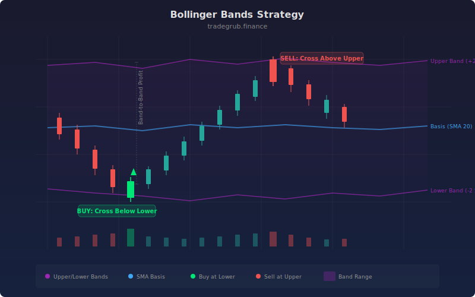 | Bollinger Band squeeze breakout with volume confirmation |
| [RSI Mean Reversion](strategies/rsi-mean-reversion/) |  | Mean reversion entries on RSI extremes with ATR stops |
| [Supertrend](strategies/supertrend/) |  | Supertrend trend-following with trailing stop |
| [MACD Crossover](strategies/macd-crossover/) |  | MACD signal line crossover with histogram confirmation |
| [EMA Crossover](strategies/ema-crossover/) | 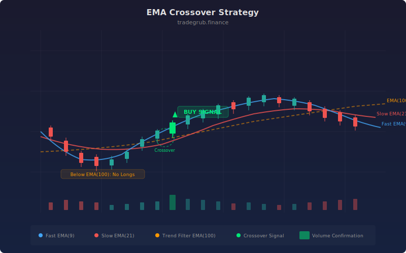 | Exponential moving average crossover strategy |
| [Ichimoku Cloud](strategies/ichimoku-cloud/) | 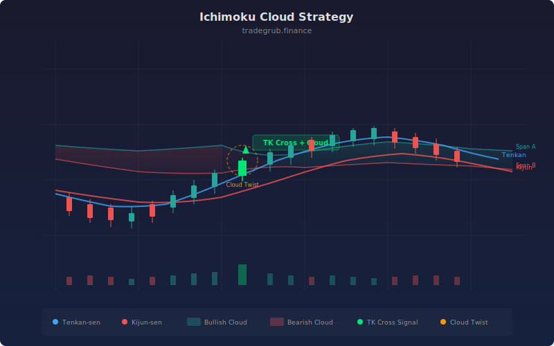 | Ichimoku cloud breakout with Tenkan/Kijun cross |
| [ATR Breakout](strategies/atr-breakout/) | 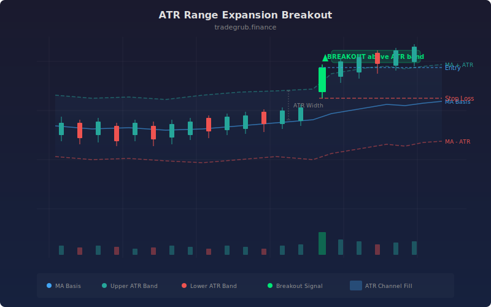 | Volatility breakout using ATR expansion |
| [Donchian Breakout](strategies/donchian-breakout/) |  | Donchian channel breakout with trend filter |
| [Descending Channel Break](strategies/descending-channel-break/) |  | Descending channel breakout with volume surge |
| [Savitzky-Golay Peak Reversal](strategies/peak-reversal/) | 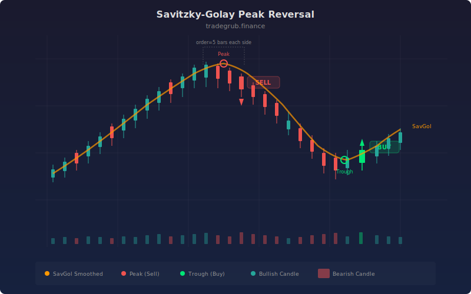 | Signal processing to detect peak/trough reversals |
| [Grid Level Trader](strategies/grid-trader/) |  | Grid trading that buys at lower price levels and sells at upper levels |
| [Safety Order DCA](strategies/dca-safety-orders/) | 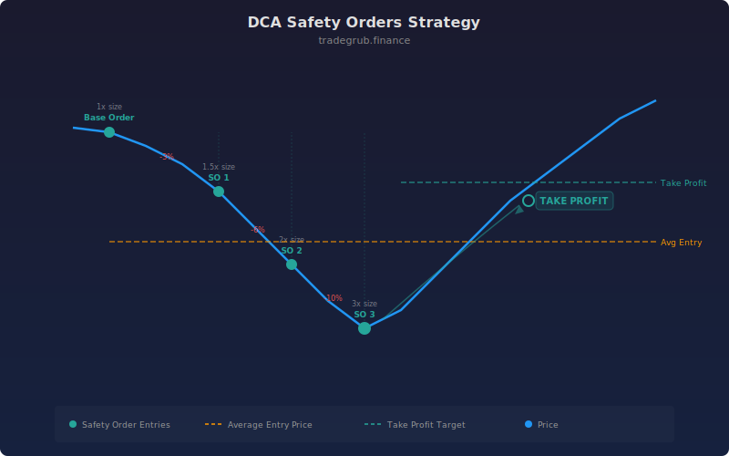 | Dollar cost averaging with safety orders at progressively lower prices |
| [Pyramid Accumulator](strategies/pyramid-accumulator/) | 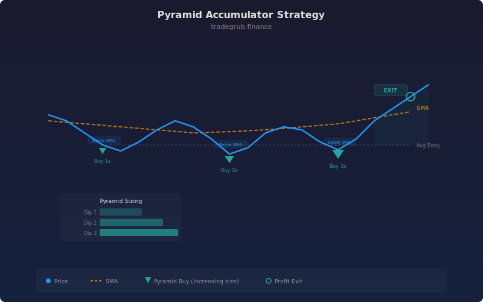 | Systematic accumulation on dips with profit target exit |
| [RMI Band Reversal](strategies/rmi-band-reversal/) | 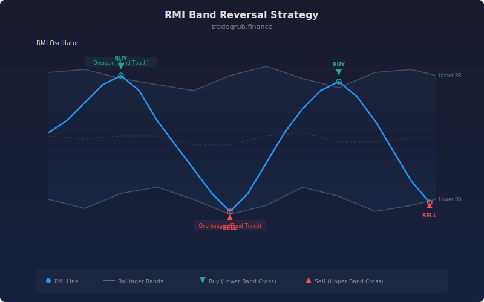 | Relative Momentum Index with Bollinger Bands for mean reversion |
| [Band Trend Breakout](strategies/band-trend-breakout/) |  | Adaptive EMA-ATR band breakout with center line trailing |
| [Martingale Grid](strategies/martingale-grid/) |  | Grid trading with martingale position sizing and average entry take profit |

**[Browse all strategies →](strategies/)**

## Indicators

| Indicator | Concept | Description |
| --------- | ------- | ----------- |
| [Market Regime Detector](indicators/regime-detector/) | 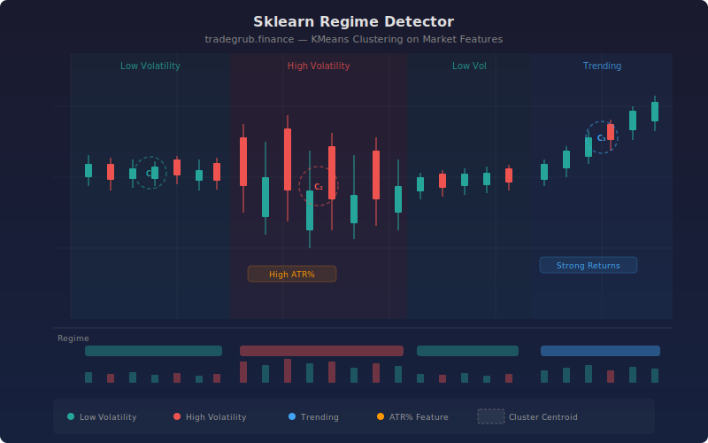 | KMeans clustering on ATR%, returns, and volume to classify market regimes |
| [Price Distribution Analysis](indicators/price-distribution/) | 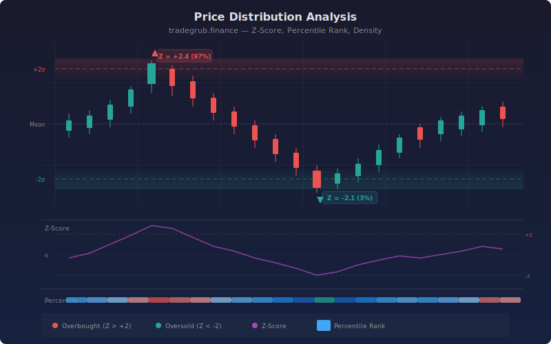 | Rolling z-score, percentile rank, and probability density for extreme levels |
| [Fourier Cycle Analysis](indicators/fourier-cycles/) |  | FFT decomposition to identify dominant price cycles and filtered reconstruction |
| [Volume Profile POC](indicators/volume-profile-poc/) | 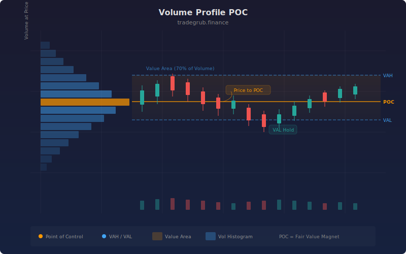 | Volume profile with point of control and value area |
| [VWAP StdDev Bands](indicators/vwap-stddev-bands/) | 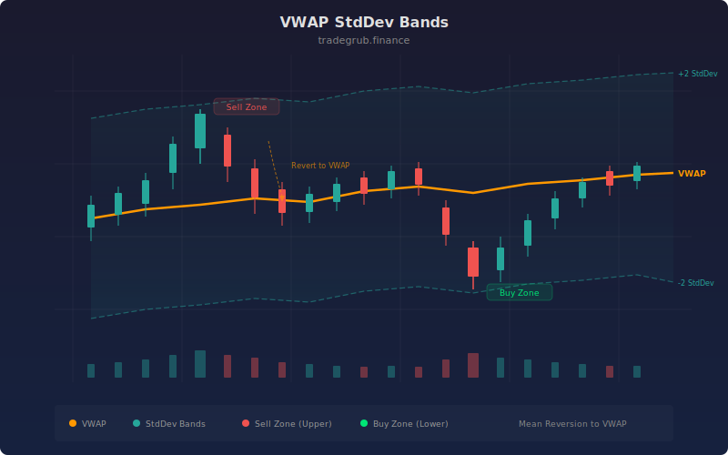 | VWAP with standard deviation bands |
| [Smart Money Concepts](indicators/smart-money-concepts/) |  | Order blocks, fair value gaps, and liquidity sweeps |
| [Supply Demand Zones](indicators/supply-demand-zones/) |  | Automatic supply and demand zone detection |
| [EMA Ribbon](indicators/ema-ribbon/) |  | Multi-period EMA ribbon for trend visualization |
| [Kalman Filter Trend](indicators/kalman-filter-trend/) | 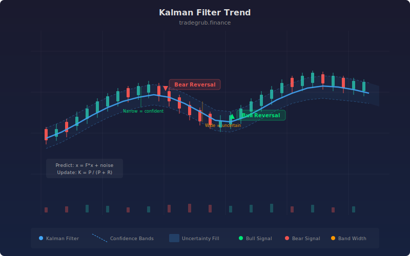 | Kalman filter smoothed trend with noise reduction |
| [Volume Divergence Scanner](indicators/volume-divergence-scanner/) |  | Swing point analysis to detect price-volume divergences |
| [Pivot Fakeout Filter](indicators/pivot-fakeout-filter/) |  | Pivot points with tolerance bands to filter false breakouts |
| [Auto Price Grid](indicators/auto-price-grid/) |  | Automatic horizontal grid from high to low with zone highlighting |
| [MA Deviation Channel](indicators/ma-deviation-channel/) | 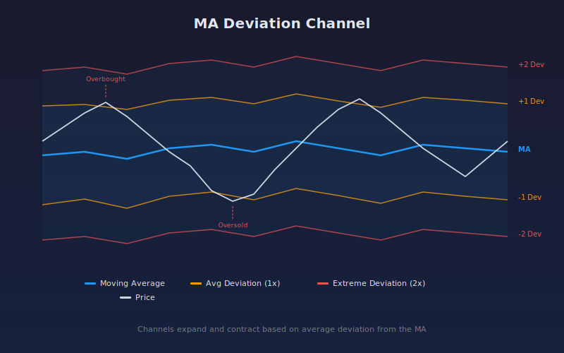 | Dynamic channels based on historical percentage deviation from a moving average |
| [Three Candle Sweep](indicators/three-candle-sweep/) | 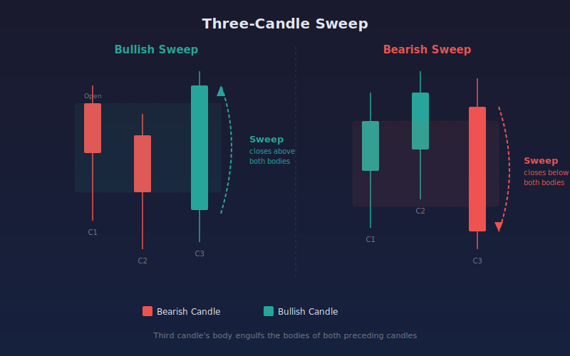 | Three-candle liquidity sweep pattern detection for price action reversals |
| [Daily Percent Levels](indicators/daily-percent-levels/) | 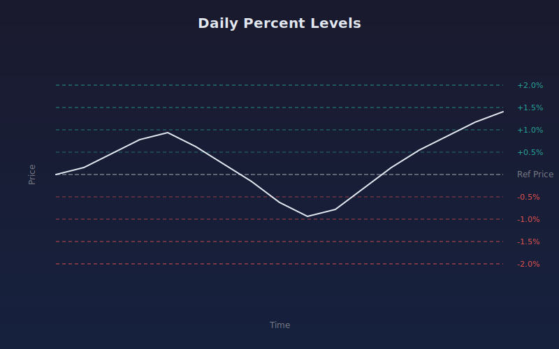 | Horizontal price levels at fixed percentage intervals from a reference price |
| [Auto Anchor VWAP](indicators/auto-anchor-vwap/) |  | Three simultaneous VWAPs with auto-detected anchors from trend highs and lows |
| [Normalized Volume Volatility](indicators/normalized-volume-volatility/) | 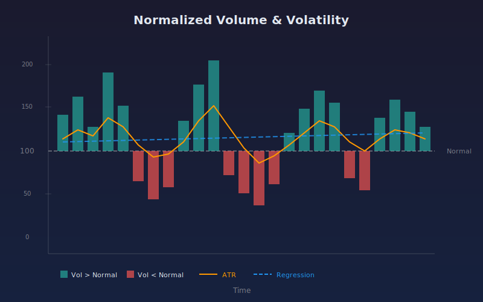 | Volume and volatility normalized against statistical baselines with regression |
| [Double Bollinger Bands](indicators/double-bollinger-bands/) | 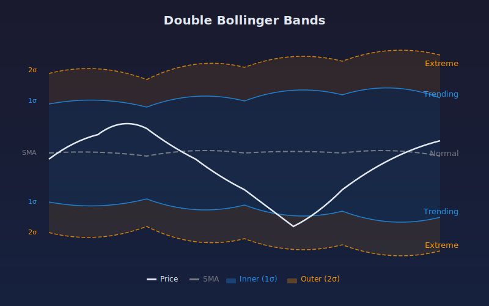 | Two sets of Bollinger Bands at 1σ and 2σ for volatility zone identification |
| [ATR Range Levels](indicators/atr-range-levels/) | 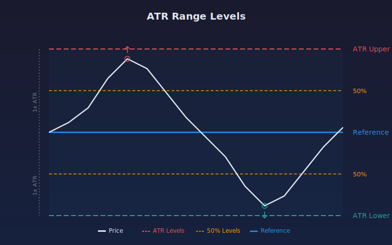 | Projected daily price range using ATR with intermediate levels |
| [Multi Period Opens](indicators/multi-period-opens/) | 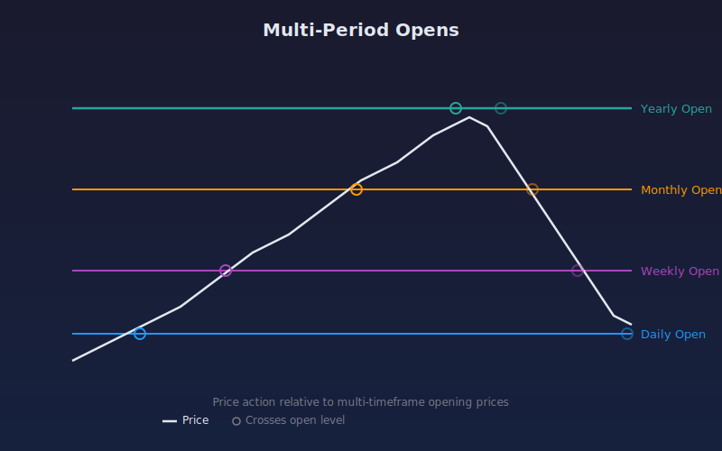 | Daily, weekly, monthly, and yearly opening price reference levels |
| [Bar Behavior Analysis](indicators/bar-behavior-analysis/) |  | Statistical odds of bullish or bearish follow-through on subsequent bars |
| [Inside Bar Failure](indicators/inside-bar-failure/) | 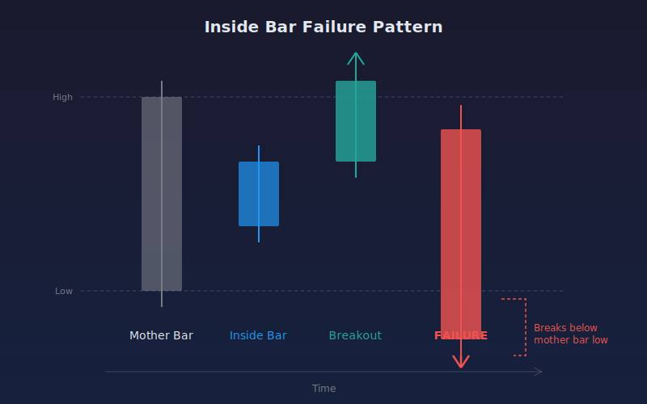 | Inside bar breakout failure detection for reversal signals |
| [Momentum Confirmed Pivots](indicators/momentum-confirmed-pivots/) | 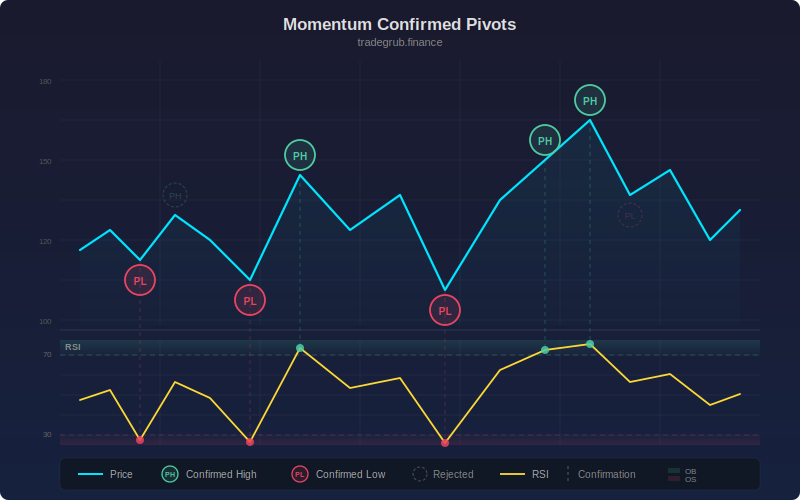 | Pivot highs and lows filtered by RSI momentum confirmation |
| [Multi-Oscillator Divergence](indicators/multi-oscillator-divergence/) | 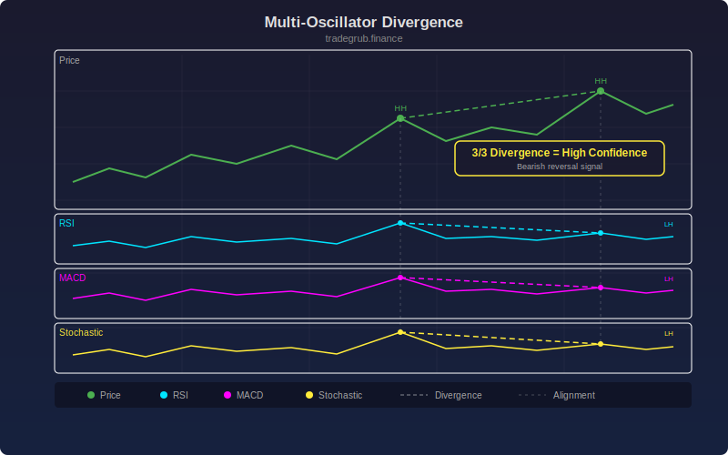 | Aggregated divergence across RSI, MACD, and Stochastic for high-confidence signals |
| [Volatility Extreme Detector](indicators/volatility-extreme-detector/) | 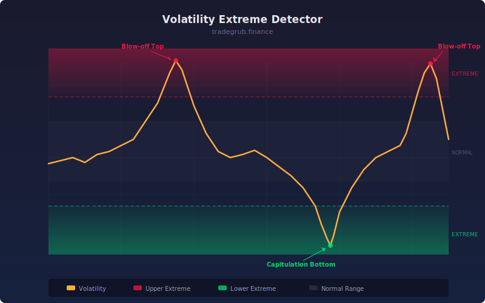 | Synthetic volatility measure detecting extreme bottoms and tops |
| [Candlestick Sentiment Score](indicators/candlestick-sentiment-score/) | 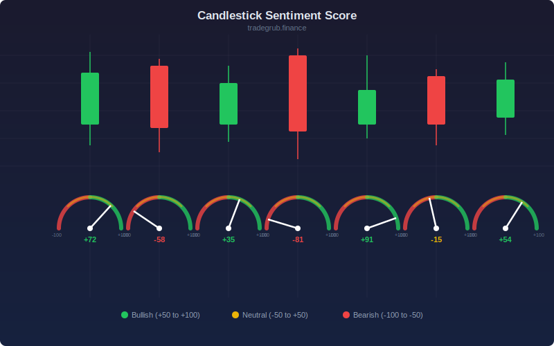 | Composite bar sentiment from body direction, close position, and wick bias |
| [Supertrend Fakeout Filter](indicators/supertrend-fakeout-filter/) | 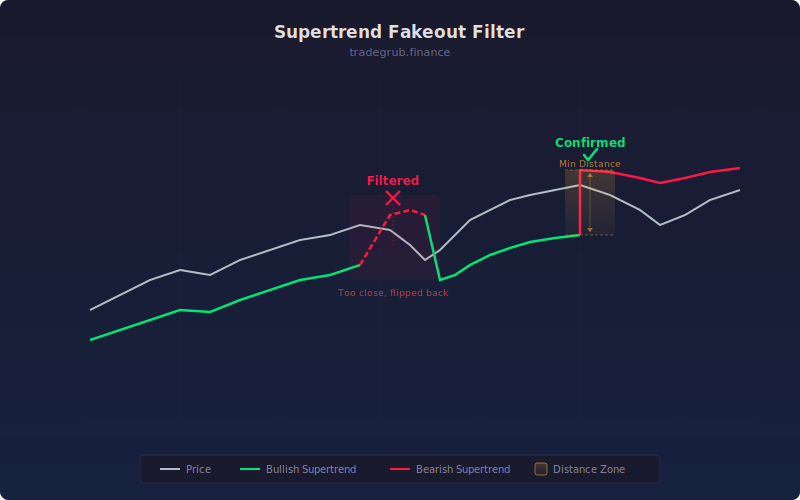 | Supertrend with post-flip distance validation to filter false reversals |
| [Combined Candle Merge](indicators/combined-candle-merge/) |  | Merges consecutive same-direction candles into single aggregate bars |
| [Quasimodo Reversal](indicators/quasimodo-reversal/) | 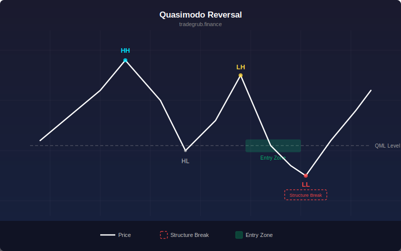 | Detects Quasimodo reversal patterns from asymmetric swing structure |
| [Volumetric Candle Intensity](indicators/volumetric-candle-intensity/) | 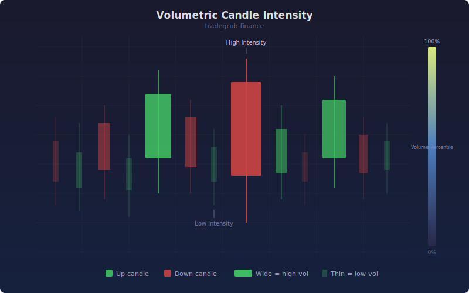 | Volume normalized by standard deviation with directional intensity coloring |
| [Supertrend Fibonacci Levels](indicators/supertrend-fibonacci-levels/) |  | Supertrend with automatic Fibonacci retracement from each trend swing |
| [Harmonic Pattern Scanner](indicators/harmonic-pattern-scanner/) | 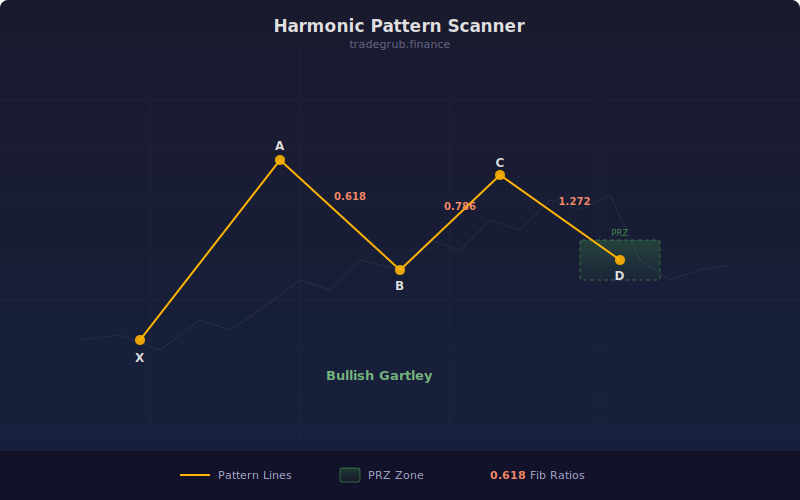 | Detects Gartley, Butterfly, Bat, and Crab patterns using zigzag swing structure |
| [Sentiment Mood Oscillator](indicators/sentiment-mood-oscillator/) | 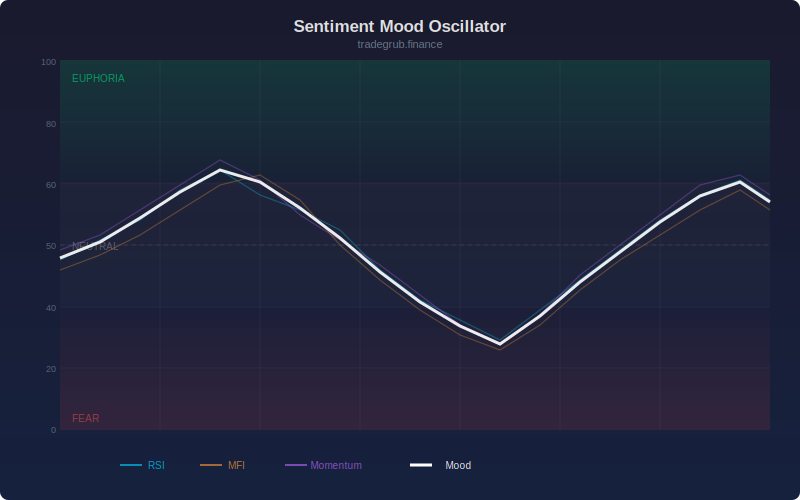 | Multi-layered sentiment oscillator combining RSI, MFI, and momentum into a mood score |
| [HalfTrend Indicator](indicators/halftrend-indicator/) |  | ATR-based trend indicator using channel midpoint logic with directional flip signals |
| [Volatility Contraction Pattern](indicators/volatility-contraction-pattern/) | 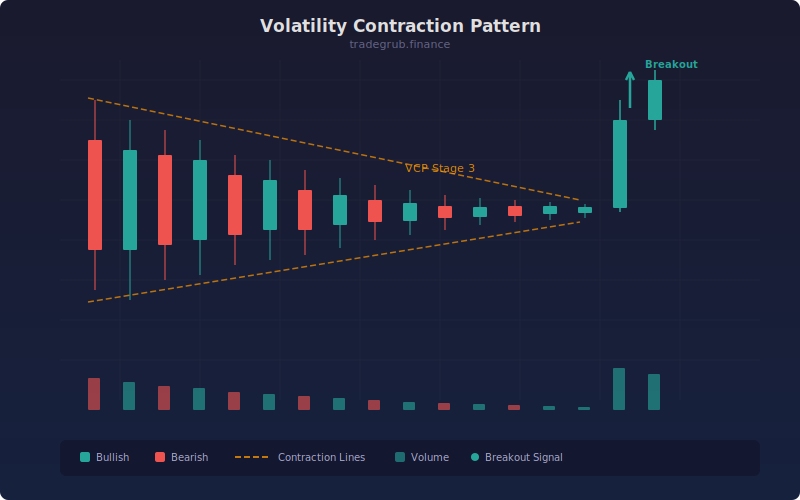 | Detects progressively tighter price ranges with declining volume for breakout setups |
| [Wyckoff Phase Detector](indicators/wyckoff-phase-detector/) | 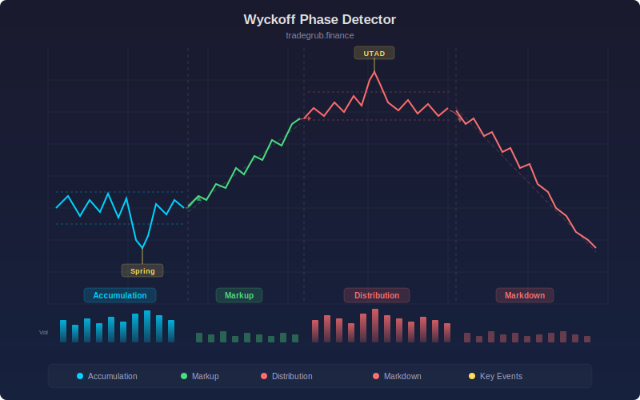 | Detects Wyckoff accumulation and distribution phases using volume patterns |
| [Central Pivot Range](indicators/central-pivot-range/) | 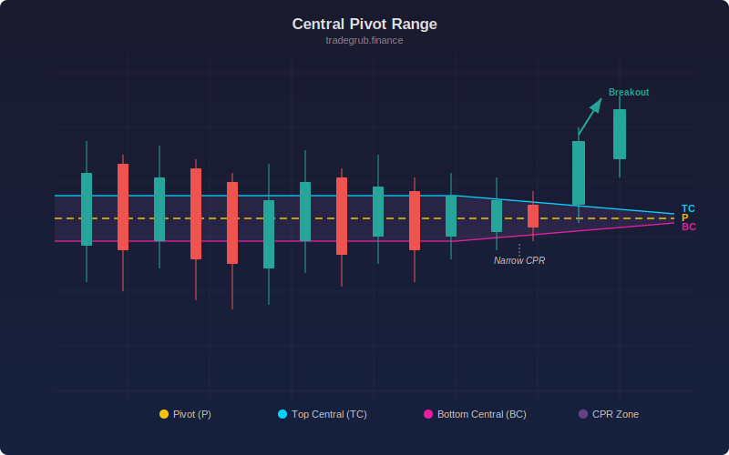 | CPR with TC/BC levels, narrow CPR breakout detection |
| [Gann Square Levels](indicators/gann-square-levels/) |  | Gann Square of Nine price levels from significant highs and lows |
| [Fibonacci Confluence Mapper](indicators/fibonacci-confluence-mapper/) |  | Finds where multiple Fibonacci retracement levels cluster together |
| [Rounding Bottom Scanner](indicators/rounding-bottom-scanner/) |  | Detects rounding bottom patterns using curvature and volume analysis |
| [Stair-Step Trend Detector](indicators/stairstep-trend-detector/) |  | Detects orderly stair-step trending with consistent step sizes |
| [Consecutive Candle Streak](indicators/consecutive-candle-streak/) | 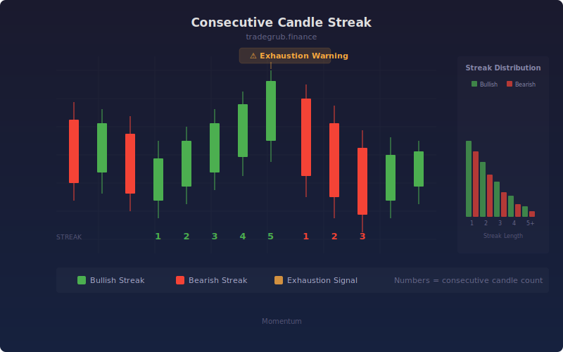 | Tracks candle streaks and identifies exhaustion points |
| [Nadaraya-Watson Envelope](indicators/nadaraya-watson-envelope/) |  | Kernel regression price channel with ATR envelopes |
| [Swing Failure Pattern](indicators/swing-failure-pattern/) | 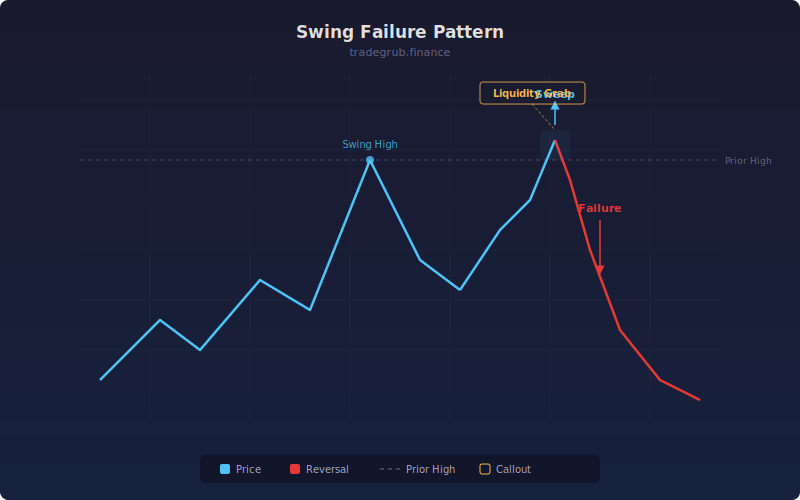 | Detects liquidity grab reversals at swing levels |
| [Monotonicity Index](indicators/monotonicity-index/) |  | Measures trend consistency and orderliness |
| [Unreached Highs/Lows](indicators/unreached-highs-lows/) |  | Gauges trend persistence via unrevisited price levels |
| [Volume Surprise Detector](indicators/volume-surprise-detector/) | 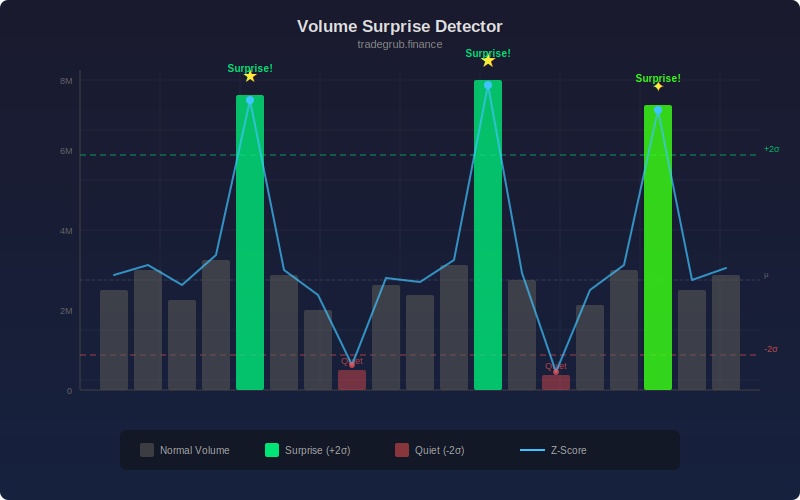 | Z-score volume anomaly detection |
| [Probabilistic Breakout Forecast](indicators/probabilistic-breakout-forecast/) |  | Statistical breakout probability from range compression |
| [Market Criticality Index](indicators/self-organized-criticality/) | 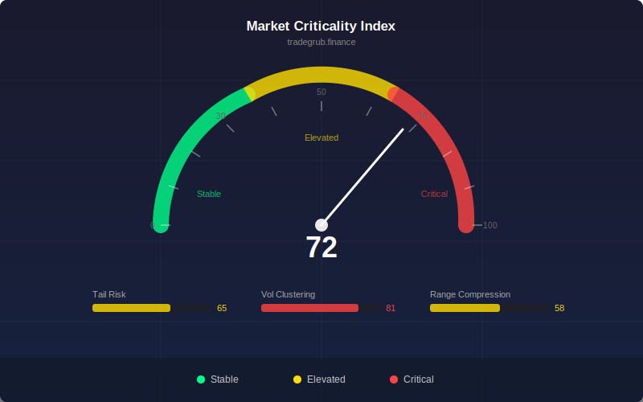 | Market fragility index combining tail risk, volatility clustering, and range compression into a 0-100 criticality score |
| [First Passage Time Estimator](indicators/first-passage-time/) | 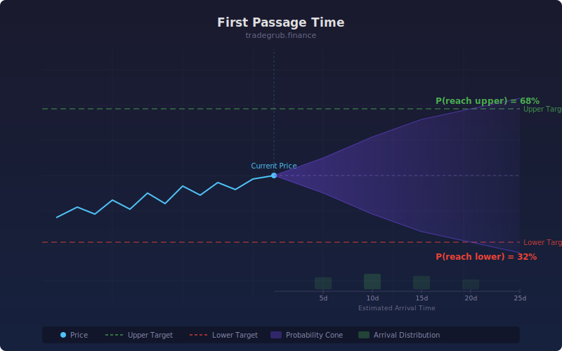 | Estimates probability of price reaching upper and lower target levels using geometric Brownian motion first passage analysis |
| [Fractal Dimension Index](indicators/fractal-dimension-index/) |  | Chaos theory metric using rescaled range analysis to determine if price is trending, random, or mean-reverting |
| [Mean Reversion Detector](indicators/adf-stationarity-test/) |  | Rolling Augmented Dickey-Fuller test to detect mean-reverting price behavior using least squares regression |
| [Markov Regime Oscillator](indicators/markov-regime-model/) | 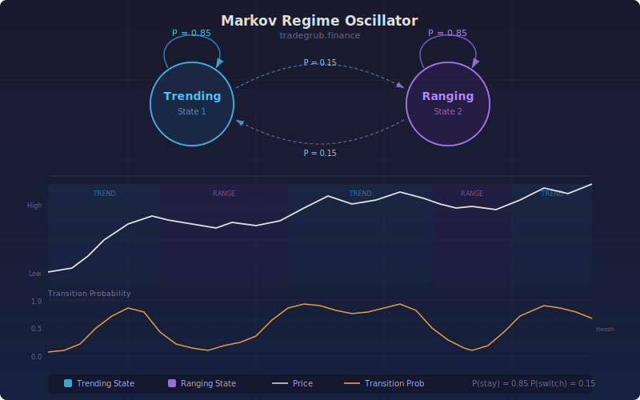 | Two-state Markov chain classifying bars as trending or ranging with rolling transition probability estimation |
| [Andean Oscillator](indicators/andean-oscillator/) | 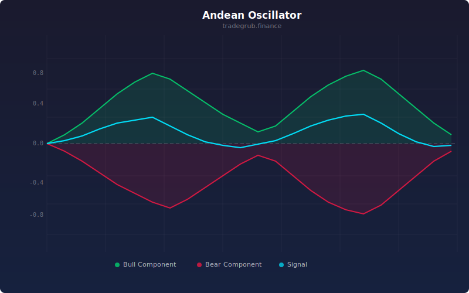 | Exponential envelope oscillator with bull and bear decomposition |
| [LOWESS Trend](indicators/lowess-trend/) |  | Locally weighted scatterplot smoothing trend line with breakout detection |
| [Logarithmic Moving Average](indicators/log-moving-average/) | 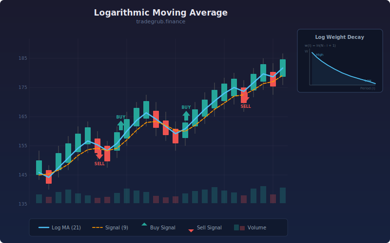 | Moving average with logarithmic weighting and signal line crossovers |
| [Trend Volatility Index](indicators/trend-volatility-index/) |  | Gini mean difference of multiple SMAs normalized to measure trend strength vs consolidation |
| [Detrended Rhythm Oscillator](indicators/detrended-rhythm-oscillator/) | 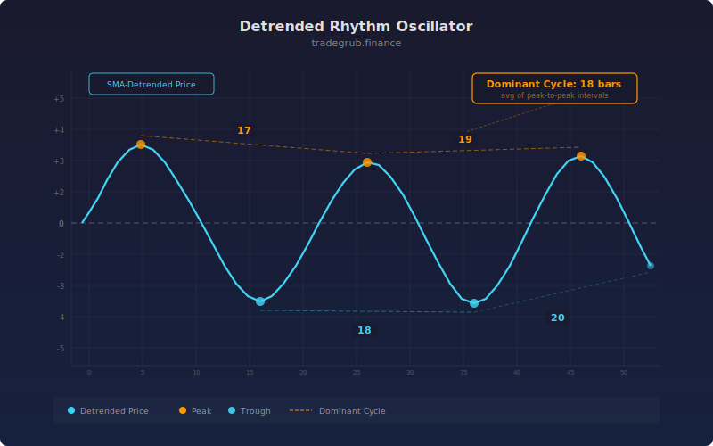 | Detrends price with SMA removal and finds dominant cycle via autocorrelation |
| [Cybernetic Oscillator](indicators/cybernetic-oscillator/) | 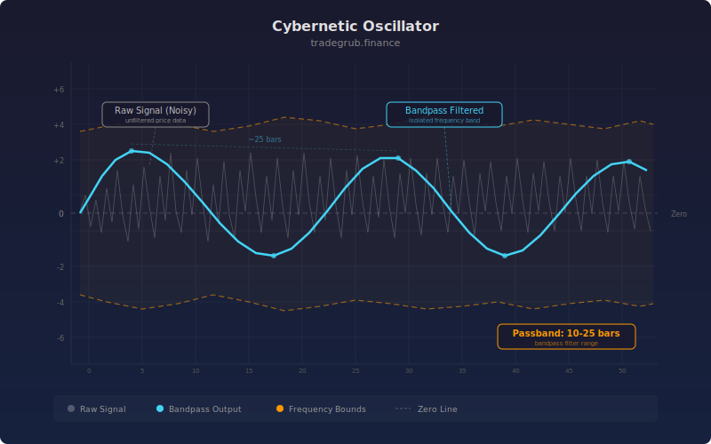 | Bandpass filter oscillator using cascaded highpass and lowpass EMA filtering |
| [MA Entanglement Index](indicators/ma-entanglement/) | 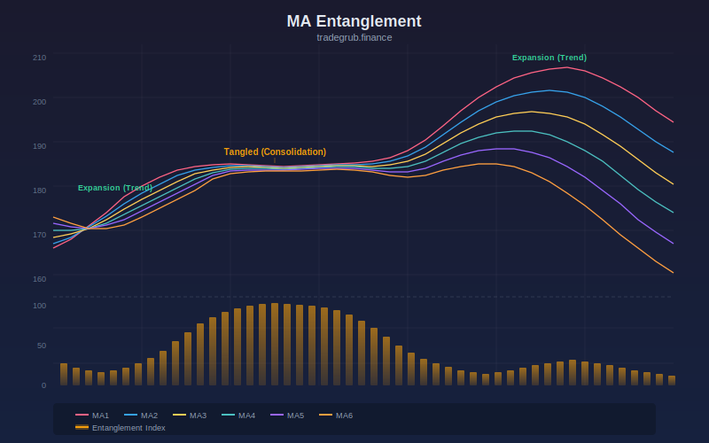 | Measures how tangled 6 moving averages are to detect consolidation vs trending |
| [Range Filter](indicators/range-filter/) |  | Volatility-adaptive stepped trend filter that only moves when price exceeds the filter by a smoothed ATR range |
| [Entropy Risk Measure](indicators/evar-risk-measure/) | 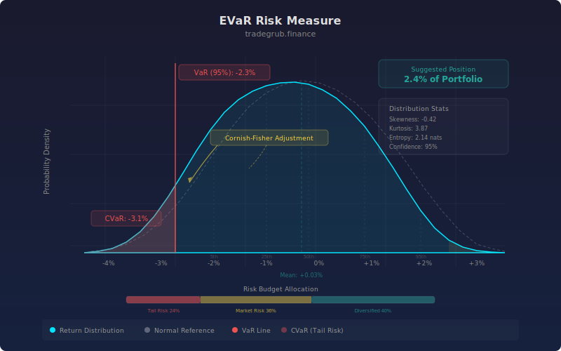 | Entropy-adjusted Value at Risk using Cornish-Fisher expansion with position sizing |
| [Stop Loss Cascade Detector](indicators/stop-loss-cascade/) | 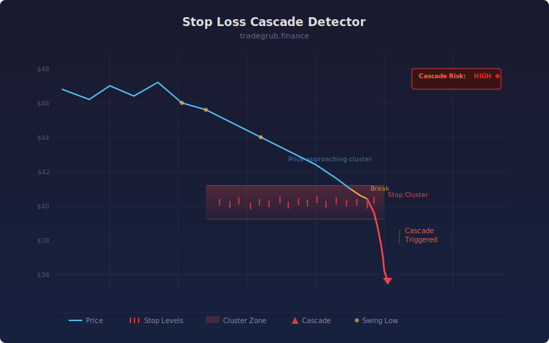 | Detects where stop losses cluster near swing levels and models cascade breakout potential |
| [Effort vs Results Oscillator](indicators/effort-vs-results/) |  | Wyckoff effort-result principle measuring volume effort against price movement results |
| [Statistical Bin S/R](indicators/bin-support-resistance/) | 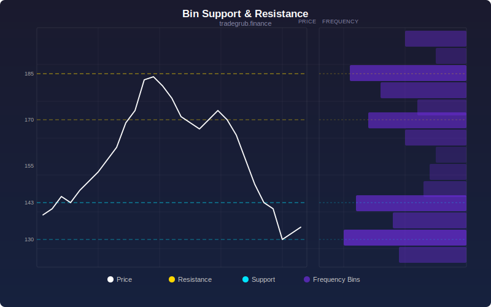 | Finds support and resistance levels by grouping price action into statistical bins |
| [Congestion Index](indicators/congestion-index/) | 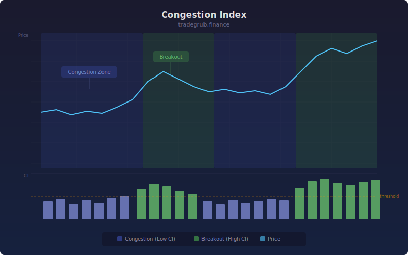 | Measures consolidation intensity by comparing N-bar range to sum of individual bar ranges |
| [Bar Shape Oscillator](indicators/bar-shape-oscillator/) | 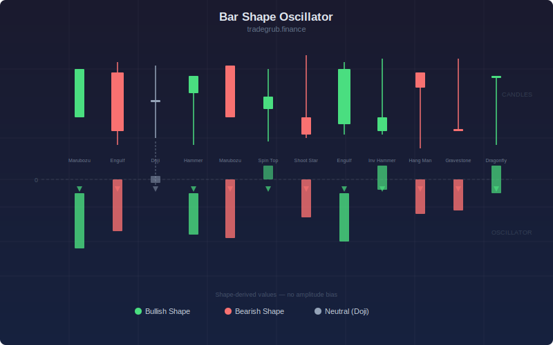 | Amplitude-free directional oscillator derived purely from candlestick bar shape ratios |
| [Volatility Estimator Suite](indicators/volatility-estimator-suite/) | 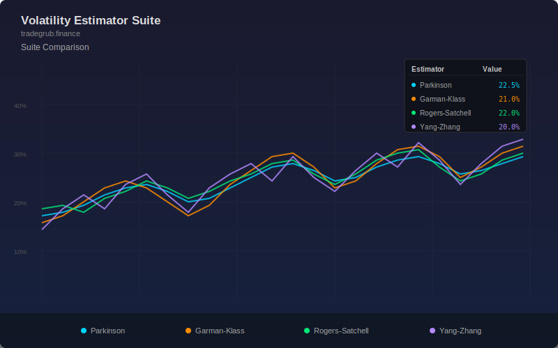 | Parkinson, Garman-Klass, Rogers-Satchell, Yang-Zhang range-based volatility estimators |
| [Hurst Cycle Pivots](indicators/hurst-cycle-pivots/) | 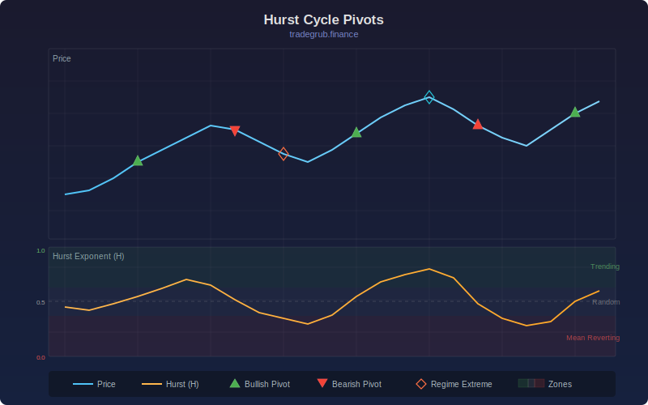 | Rolling Hurst exponent via R/S analysis for trending vs mean-reverting regime detection |
| [Linear Predictive Filter](indicators/linear-predictive-filter/) | 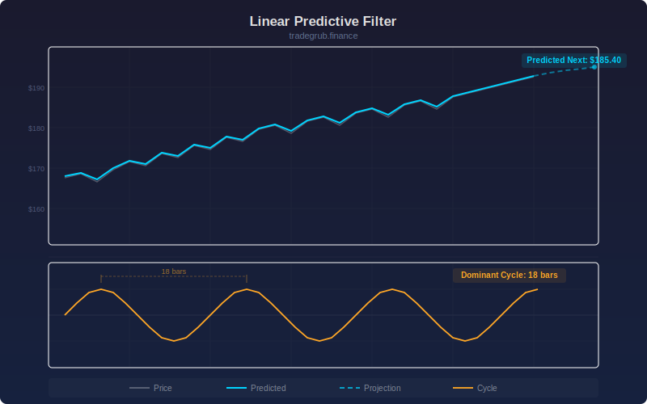 | LPC via Yule-Walker equations to extract dominant cycles and predict next price value |
| [Trend Template Qualifier](indicators/minervini-qualifier/) |  | Scores stocks 0-6 against stage-2 trend template conditions |
| [Smoothed Price Candles](indicators/berlin-candles/) | 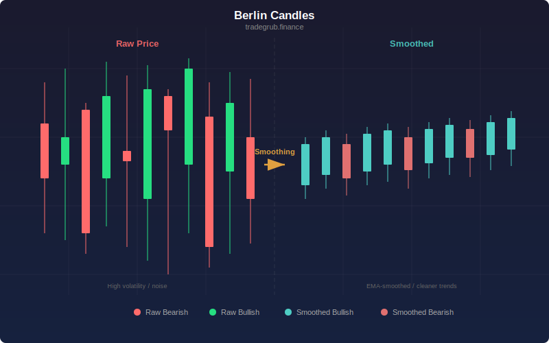 | EMA-smoothed OHLC candles that preserve actual close prices and high/low extremes |
| [MESA Adaptive Stochastic](indicators/mesa-stochastic/) |  | Stochastic oscillator with adaptive period from autocorrelation cycle detection |
| [Optimized Trend Tracker](indicators/optimized-trend-tracker/) | 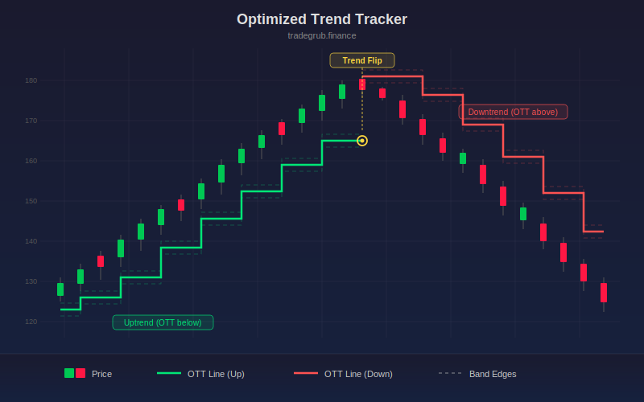 | Percentage-based optimized trailing trend tracker using EMA with adaptive bands |
| [Phase Loop Oscillator](indicators/ehlers-phase-loop/) | 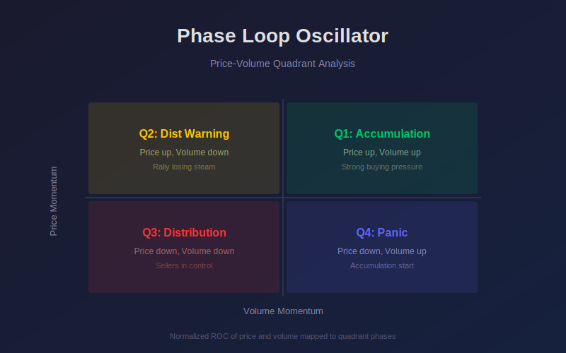 | Price-volume quadrant analysis for detecting accumulation and distribution phases |
| [WaveTrend Enhanced](indicators/wavetrend-enhanced/) | 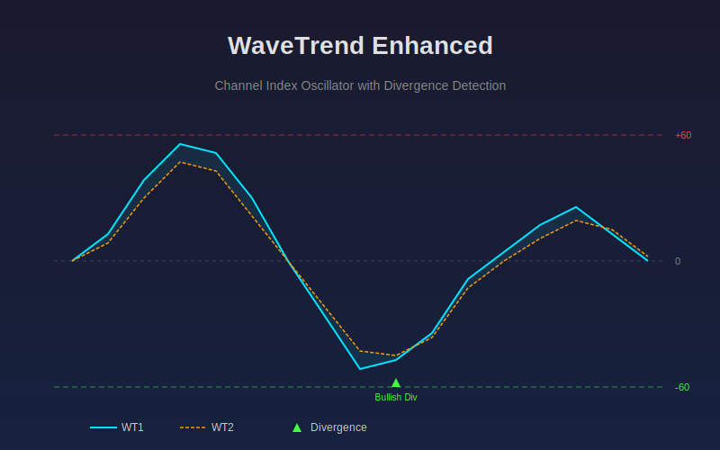 | Enhanced WaveTrend with channel index smoothing and automated divergence detection |
| [Distance Classifier](indicators/lorentzian-classifier/) |  | KNN classifier using Lorentzian distance across RSI, CCI, ROC, and volatility features |
| [Candlestick Pattern Score](indicators/adaptive-candlestick-score/) | 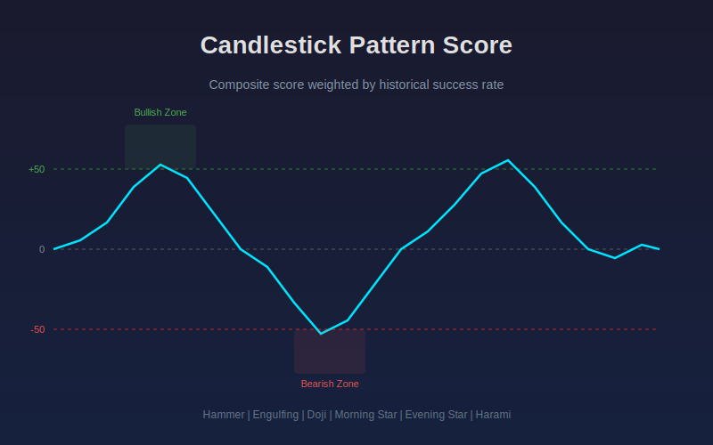 | Composite candlestick pattern score weighted by historical success rate |
| [Absorption Detector](indicators/absorption-detector/) |  | Detects where large passive orders absorbed aggressive flow |
| [Bar Efficiency Ratio](indicators/bar-efficiency-ratio/) | 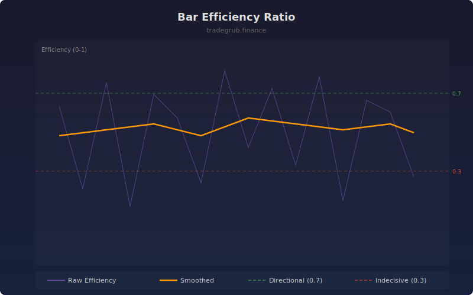 | Measures price movement efficiency within each bar as body to range ratio |
| [Time at Price Levels](indicators/time-at-price/) | 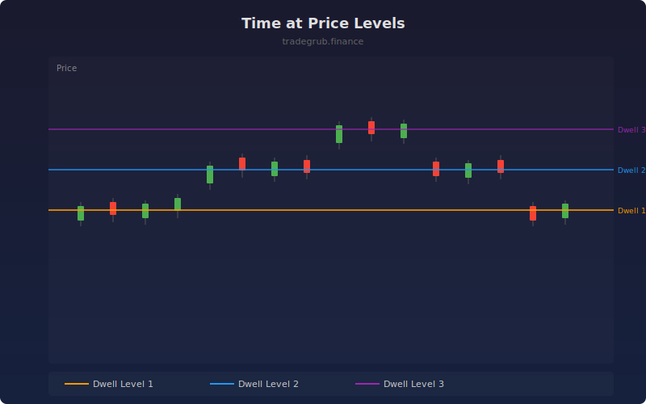 | Finds consolidation zones by counting bar dwell time per price level |
| [Movement Probability](indicators/gap-probability/) | 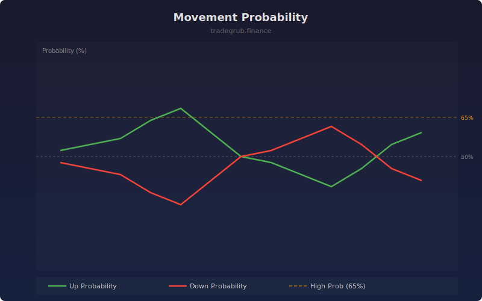 | Calculates next bar direction probability based on historical z-score patterns |
| [Probability Reversal Grid](indicators/probability-grid/) |  | Reversal probability based on position within recent range and historical zone behavior |
| [Arc Breakout Signals](indicators/d-shape-breakout/) |  | Semi-circular arc-based support and resistance with curved breakout zones |
| [Causal Adaptive Smoother](indicators/causal-smoothing/) |  | Adaptive smoothing that reduces lag in calm markets and increases stability in volatile ones |
| [Momentum Rank](indicators/sector-momentum-rank/) |  | Weighted percentile composite of momentum across multiple timeframes |
| [Oscillator Channel Overlay](indicators/oscillator-channel-overlay/) |  | Maps RSI values into a regression channel on the price chart |
| [Sequential Exhaustion Counter](indicators/sequential-exhaustion/) | 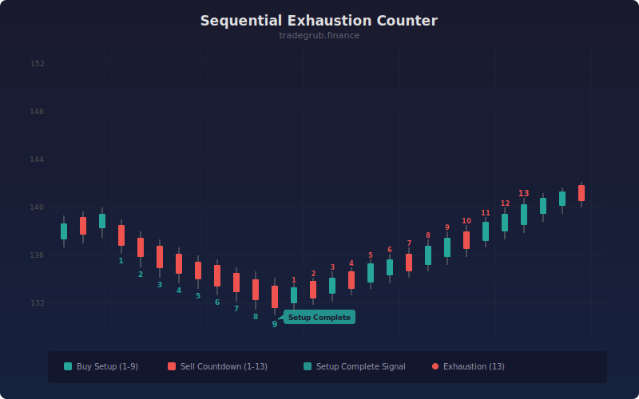 | DeMark-style sequential counting system with setup and countdown phases |
| [Elliott Wave Counter](indicators/elliott-wave-counter/) | 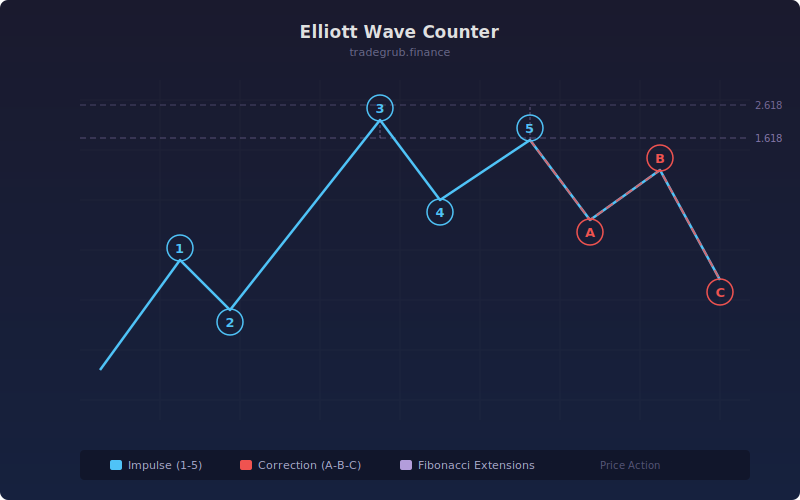 | Automated Elliott Wave detection with 5-wave impulse pattern recognition |
| [Gap Closure Probability](indicators/gap-closure-stats/) | 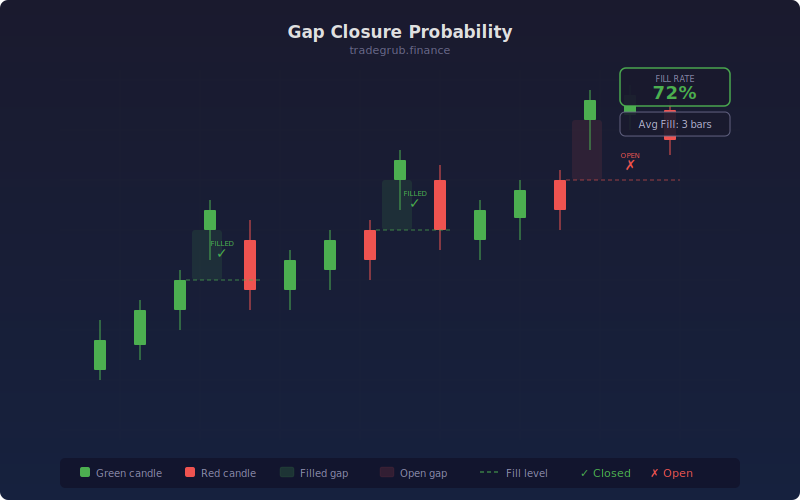 | Track price gap fill rates and display rolling closure probability |
| [Seasonal Pattern Projection](indicators/seasonal-projection/) |  | Average historical returns by cycle position to project seasonal direction |
| [Ease of Movement](indicators/ease-of-movement/) | 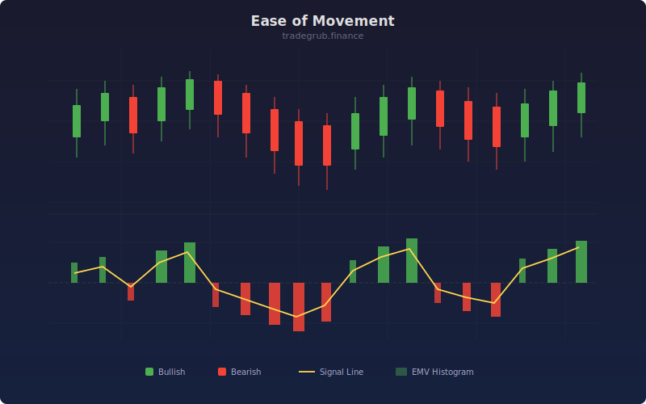 | Classic EMV measuring price movement efficiency relative to volume |
| [Spacetime Curvature Attractor](indicators/spacetime-attractor/) |  | Physics-inspired mean reversion using volume mass and price acceleration |
| [Wave Phase Coherence](indicators/wave-phase-coherence/) | 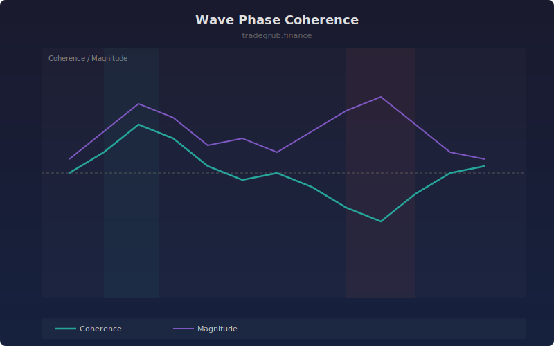 | Constructive/destructive interference between RSI at three timeframes |
| [Impulse Decay Coefficient](indicators/impulse-decay/) |  | Measures how much an impulse move has been absorbed by the pullback |
| [Skew Divergence Oscillator](indicators/skew-divergence/) |  | Return skewness tracking with price-distribution divergence detection |
| [Tail Risk Oscillator](indicators/tail-risk-oscillator/) |  | Excess kurtosis and skewness for elevated tail risk detection |
| [Dominant Cycle Length](indicators/dominant-cycle-length/) | 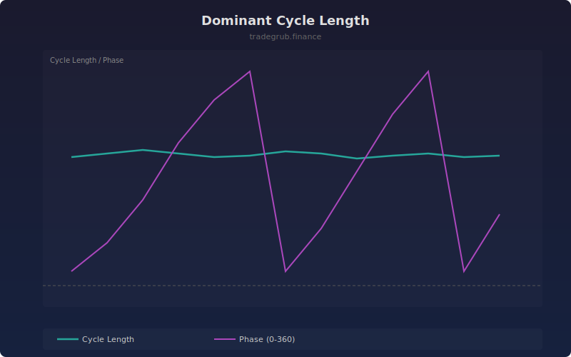 | Reports dominant cycle length and current phase via autocorrelation |
| [Composite Reversion Score](indicators/composite-reversion/) |  | Blends momentum percentile, streak, and return percentile into reversion score |
| [Psychological Price Levels](indicators/psychological-levels/) |  | Auto-drawn round number levels based on price magnitude |
| [Topographic Volume Nodes](indicators/topographic-volume-nodes/) | 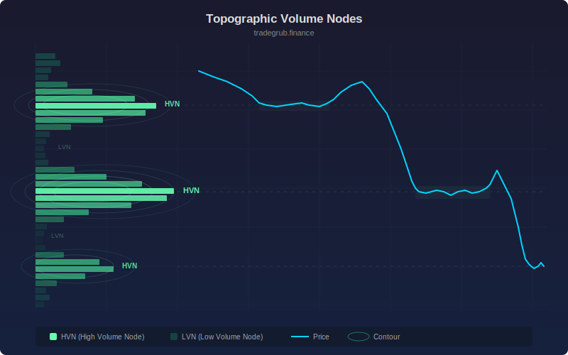 | Terrain prominence algorithm for high-volume price level detection |
| [Wick Asymmetry Ratio](indicators/wick-asymmetry/) | 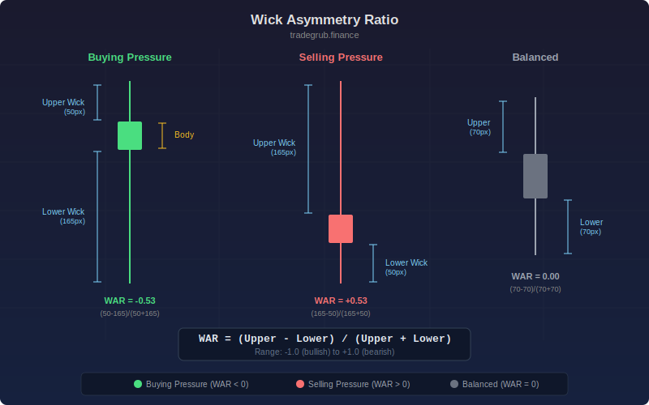 | Bounded oscillator measuring upper vs lower wick rejection pressure |
| [Candle Density Indicator](indicators/candle-density/) | 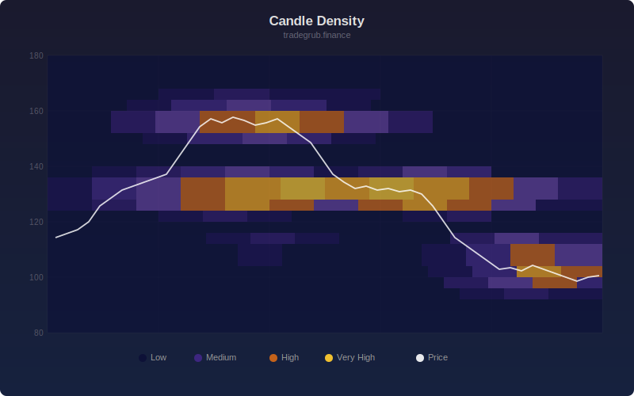 | Candle body overlap density for congestion zone detection |
| [Kinetic Slippage Index](indicators/kinetic-slippage/) | 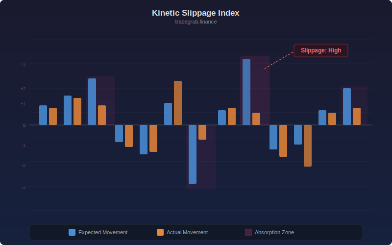 | Gap between volume-implied and actual price movement |
| [Decennial Cycle Projection](indicators/round-trip-decay/) |  | Historical returns mapped by cycle position for seasonal projection |
| [Harmonic Adaptive Ribbon](indicators/harmonic-ribbon/) |  | Auto-tuned MA ribbon at harmonic multiples of detected dominant cycle |
| [Tilson T3 Moving Average](indicators/tilson-t3/) | 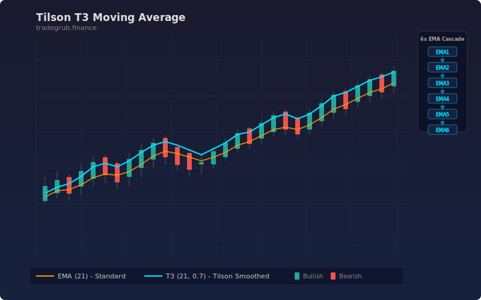 | Six-stage ultra-smooth moving average with signal line |
| [Attention State Classifier](indicators/attention-classifier/) | 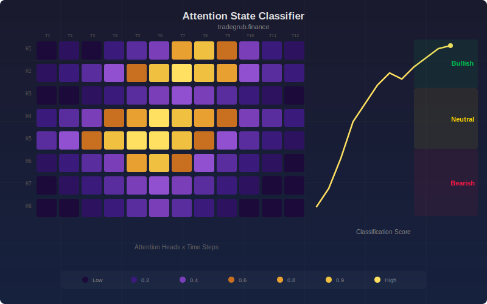 | Transformer-style attention matching current state against historical patterns |
| [Projected Volume Estimate](indicators/projected-volume/) |  | Estimates projected final volume based on historical accumulation patterns |
| [Prime Cycle Timing](indicators/goldbach-timing/) |  | Prime number and Fibonacci cycle detection for reversal timing |
| [Liquidity Flow Proxy](indicators/m2-liquidity-proxy/) | 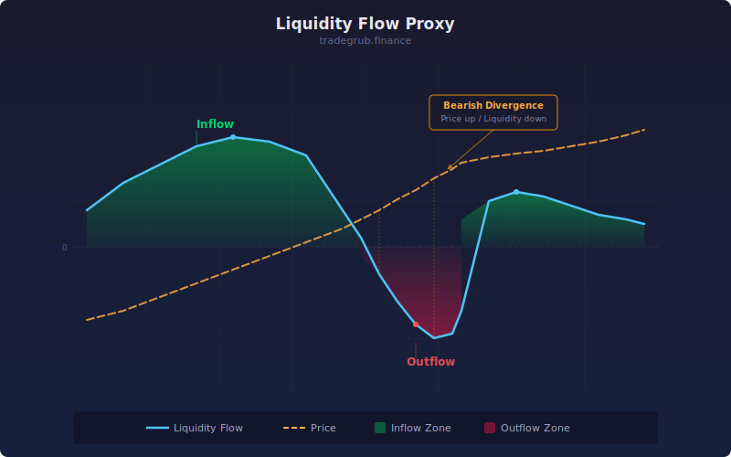 | Cumulative directional volume as a proxy for macro liquidity flow |

**[Browse all indicators →](indicators/)**
