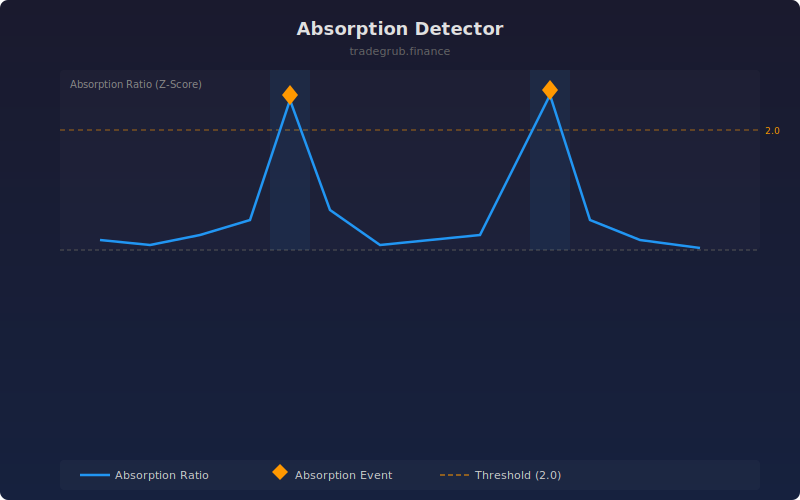

# Absorption Detector

Detects bars where large passive orders absorbed aggressive selling or buying pressure. High volume with minimal price movement suggests institutional absorption at key levels.

## How It Works

- Computes absorption ratio: volume divided by absolute bar body size
- Normalizes the ratio as a z-score against its rolling mean and standard deviation
- Extreme z-scores indicate disproportionate volume relative to price movement
- Marks absorption events with diamond shapes and background shading

## Parameters

| Parameter | Default | Range | Description |
|-----------|---------|-------|-------------|
| Length | 20 | 5-100 | Rolling window for mean and standard deviation |
| Threshold | 2.0 | 1.0-5.0 | Z-score threshold to flag absorption events |

## Outputs

- **Absorption Ratio**: Blue z-score normalized line
- **Threshold**: Orange dashed line at the configured threshold
- **Zero Line**: Gray dashed baseline
- **Absorption Events**: Orange diamonds on extreme bars
- **Background**: Blue shading during absorption events

## Usage Notes

- Absorption at support often precedes bounces; absorption at resistance can precede reversals
- Combine with price level indicators to confirm key support and resistance zones
- Lower thresholds catch more events but include more noise
