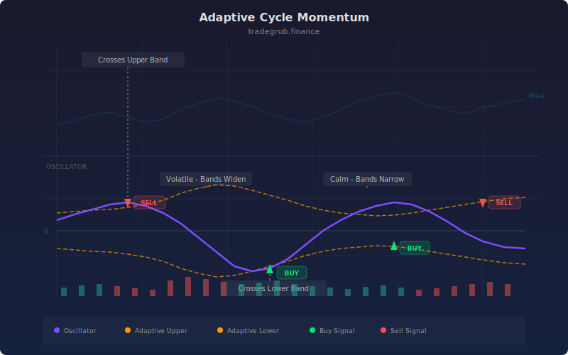

# Adaptive Cycle Momentum

Advanced oscillator-based momentum indicator for reversal and continuation setups using adaptive threshold technology with scipy statistical analysis. This momentum indicator provides quantitative signals that can be applied to any liquid market across all timeframes.

## Conceptual Diagram



## How It Works

The indicator analyzes price data using momentum techniques to produce actionable signals.

Built-in technical functions used: `macd, rsi`. These provide the foundation for the indicator's calculations, computed efficiently across the full price history in a single pass.

Core techniques include simple moving average, RSI, MACD, iterative computation. The computation processes all bars simultaneously using vectorized numpy operations, ensuring consistent results regardless of the dataset size.

Integer parameters control window lengths and thresholds, allowing the indicator to adapt from scalping on short timeframes to position trading on weekly charts. Shorter windows increase sensitivity to recent price action while longer windows provide smoother, more reliable signals.

## Parameters

| Parameter | Default | Range | Description |
|-----------|---------|-------|-------------|
| Cycle Length | 20 | 10 - 60 | Controls cycle length sensitivity (int) |
| Smoothing | 5 | 2 - 15 | Controls smoothing sensitivity (int) |
| Adaptive Window | 50 | 20 - 150 | Controls adaptive window sensitivity (int) |

## Signals

- **Cycle Momentum**: Primary visual output plotted as a continuous line on the chart
- **Upper Band**: Primary visual output plotted as a continuous line on the chart
- **Lower Band**: Primary visual output plotted as a continuous line on the chart
- **Bull Cross**: Discrete signal marker displayed at key points
- **Bear Cross**: Discrete signal marker displayed at key points
- **Zero** (0): Reference level for threshold-based decisions
- **Background shading**: Highlights active signal zones based on bull_zone.tolist()
- **Background shading**: Highlights active signal zones based on bear_zone.tolist()

## Python Advantage

The entire computation runs as vectorized numpy operations, processing all bars simultaneously rather than one at a time:

```python
rsi_arr = np.array(ta.rsi(close, length), dtype=float)
rsi_arr = np.nan_to_num(rsi_arr, nan=50.0)

macd_l, macd_s, macd_h = ta.macd(close, 12, 26, 9)
macd_hist = np.array(macd_h, dtype=float)
macd_hist = np.nan_to_num(macd_hist, nan=0.0)

rsi_norm = (rsi_arr - 50) / 50
macd_norm = np.zeros(n)
for i in range(adapt_window, n):
```

Python's numpy arrays allow element-wise arithmetic across thousands of bars in a single expression. Adding custom variations or combining with other calculations is straightforward, requiring only standard array operations.

## When to Use

- Detect acceleration or deceleration in price movement
- Identify divergences between price and momentum for reversal signals
- Confirm breakout strength before committing capital
- Time exits when momentum begins to fade

Works best on daily and intraday charts for liquid instruments. Shorter parameter values suit scalping and day trading while longer values work for swing and position trading.

## Risk Management

No indicator is predictive on its own. Always define risk before entering a trade:

- Set stop-losses based on ATR or recent swing points, not arbitrary percentages
- Size positions so that a stop-loss hit risks no more than 1-2% of account equity
- Avoid adding to losing positions based solely on indicator readings
- Backtest parameter combinations on out-of-sample data before live trading

## Combining with Other Indicators

- **Moving Average Ribbon**: Use the Moving Average Ribbon to confirm the overall trend direction before acting on this indicator's signals. Trading in the direction of the ribbon produces higher win rates.
- **Volume Profile POC**: When this indicator's signal aligns with a high-volume node from the Volume Profile, the confluence creates a stronger setup with better follow-through.
- **ATR-Based Stops**: Use ATR to set stop-losses that respect current volatility. Tighter stops in low-volatility environments and wider stops during volatile periods improve the reward-to-risk ratio.
