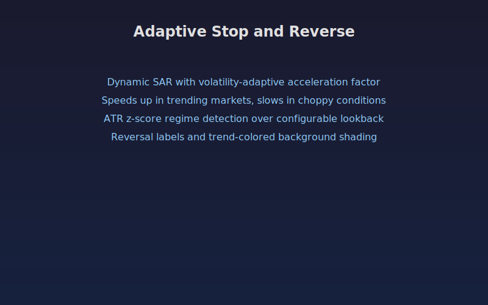

## Adaptive Stop and Reverse

A parabolic stop-and-reverse indicator that dynamically adjusts its acceleration factor based on current volatility conditions. In trending markets (high ATR relative to recent history), the SAR accelerates faster to lock in profits. In choppy, range-bound markets, it slows down to avoid whipsaws.

The volatility regime is detected using a z-score of ATR values over a configurable lookback window. This z-score scales the acceleration factor up or down from its base value.

### Parameters

- **ATR Length**: Period for Average True Range calculation (default: 14)
- **Min Acceleration Factor**: Floor for the adaptive AF (default: 0.01)
- **Max Acceleration Factor**: Ceiling for the adaptive AF (default: 0.20)
- **AF Step Size**: Base increment when new extreme point is reached (default: 0.02)
- **Volatility Lookback**: Window for computing ATR mean and standard deviation (default: 50)
- **Show Reversal Labels**: Toggle "R" labels at trend flip points
- **Show Background Fill**: Toggle green/red background shading for trend direction

### Signals

- **Green dots below price**: Bullish SAR, trend is up
- **Red dots above price**: Bearish SAR, trend is down
- **"R" labels**: Reversal points where trend direction flipped
- **Background shading**: Green tint during uptrends, red tint during downtrends
- **Adaptive AF pane**: Shows the current acceleration factor value, useful for gauging how aggressively the SAR is tracking price

## Conceptual Diagram

