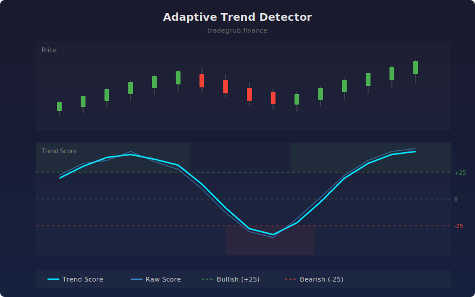

# Adaptive Trend Detector

Uses an online learning classifier trained on a rolling window to estimate directional market pressure. Features include price position relative to SMA/EMA and normalized RSI, producing a trend score that adapts to changing market conditions.

## How It Works

- Extracts features: price distance from SMA and EMA (normalized by ATR), and normalized RSI
- Trains an SGD classifier on a rolling lookback window to predict next-bar direction
- Outputs a trend score from -100 (strong bearish) to +100 (strong bullish)
- Applies smoothing to reduce noise in the raw classification output
- Background shading highlights bullish (above +25) and bearish (below -25) regimes

## Parameters

| Parameter | Default | Range | Description |
|-----------|---------|-------|-------------|
| Feature Length | 20 | 5-50 | Period for SMA, EMA, RSI, and ATR calculations |
| Training Lookback | 80 | 40-150 | Rolling window for classifier training |
| Smoothing | 5 | 1-15 | SMA smoothing applied to the raw trend score |

## Outputs

- **Trend Score**: Smoothed directional pressure score (cyan line, -100 to +100)
- **Raw Score**: Unsmoothed classifier output (blue line)
- **Reference Lines**: Bullish (+25), bearish (-25), and zero levels
- **Background**: Green shading for bullish, red for bearish regimes

## Usage Notes

- Trend score crossing zero often coincides with trend reversals
- Strong readings above +50 or below -50 indicate high-confidence directional pressure
- Shorter training lookback adapts faster but may produce more false signals
