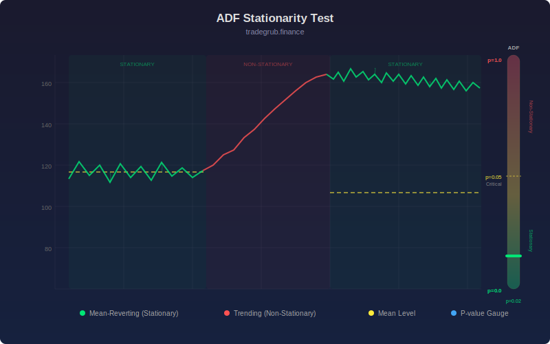

# Mean Reversion Detector

Performs a rolling Augmented Dickey-Fuller test on price to detect mean-reverting behavior. For each bar, regresses the first difference of price on the lagged level using least squares. The resulting t-statistic indicates stationarity: more negative values indicate stronger mean reversion. Critical values at 5% (-2.86) and 1% (-3.43) are shown as reference lines.

## Conceptual Diagram

## Parameters

| Parameter | Default | Range | Description |
|-----------|---------|-------|-------------|
| Lookback | 50 | 20-200 | Rolling window for the ADF regression |

## Signals

- t-statistic below -2.86: statistically significant mean reversion at 5% level
- t-statistic below -3.43: highly significant mean reversion at 1% level
- t-statistic near zero or positive: no mean reversion detected, price has unit root
- Green background shading: mean reversion regime active

## Usage

Use to identify when a stock or pair is mean-reverting and suitable for mean-reversion strategies such as Bollinger Band trading or pairs trading. When the t-statistic is above the critical values, avoid mean-reversion approaches and consider trend-following instead.
