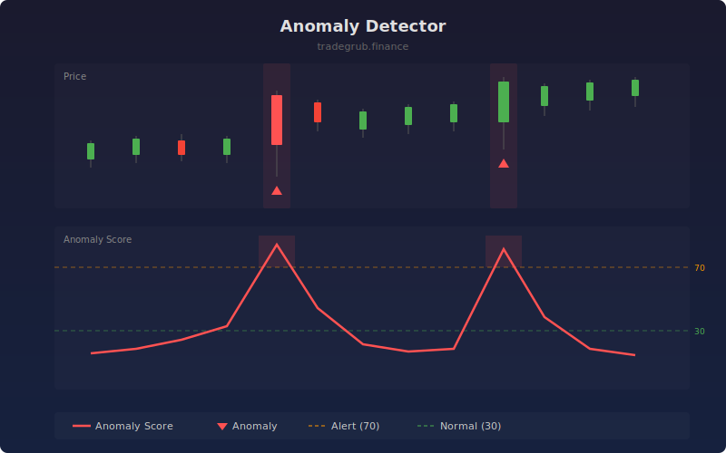

# Anomaly Detector

Uses an isolation forest algorithm to detect anomalous price and volume patterns in real time. Anomalies can indicate unusual institutional activity, news-driven moves, or developing breakouts that deviate from normal market behavior.

## How It Works

- Extracts features: bar-to-bar return, volume ratio, candle body ratio, and range normalized by ATR
- Trains an isolation forest on a rolling window to learn normal market behavior
- Scores the current bar's deviation from normal patterns (0-100 scale)
- Flags bars classified as anomalies with triangle markers
- Background shading highlights periods of elevated anomaly scores

## Parameters

| Parameter | Default | Range | Description |
|-----------|---------|-------|-------------|
| Feature Length | 14 | 5-50 | Period for ATR and volume SMA calculations |
| Training Window | 100 | 50-200 | Rolling window for isolation forest training |
| Contamination | 0.05 | 0.01-0.20 | Expected proportion of anomalies in the data |

## Outputs

- **Anomaly Score**: Normalized anomaly intensity (red line, 0-100)
- **Alert Level**: Dashed orange line at score 70
- **Normal Level**: Dashed green line at score 30
- **Anomaly Markers**: Red triangles on detected anomaly bars
- **Background**: Red shading when score exceeds alert level

## Usage Notes

- High anomaly scores combined with volume spikes often precede significant price moves
- Not all anomalies are tradeable; use as a filter alongside directional indicators
- Lower contamination values produce fewer but more extreme anomaly detections
