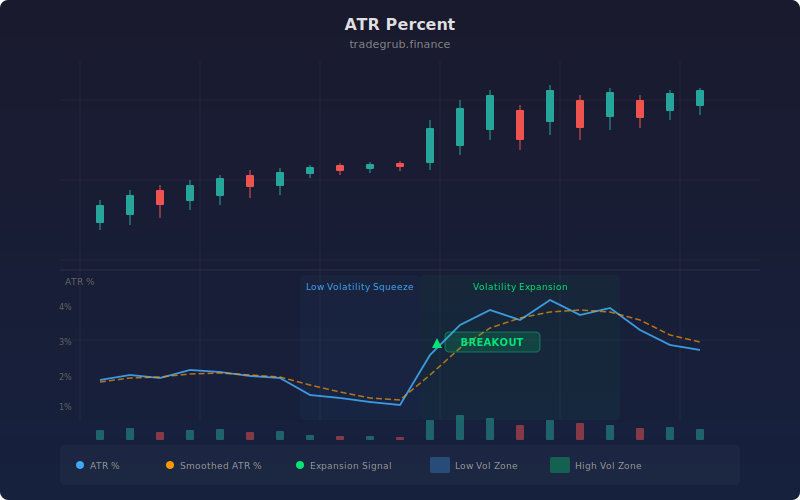

# ATR Percent

The Average True Range Percent indicator normalizes Wilder's ATR by expressing it as a percentage of the closing price, enabling direct volatility comparison across instruments regardless of absolute price level. Originally developed as an enhancement to J. Welles Wilder's 1978 ATR, this percentage normalization means a $10 stock and a $500 stock produce comparable readings, making it indispensable for portfolio-level volatility screening, position sizing, and identifying volatility regime shifts before they appear on raw ATR alone.

## Conceptual Diagram



## How It Works

The indicator first computes the Average True Range over a configurable lookback period (default 14 bars). True Range is the greatest of: current high minus current low, absolute value of current high minus previous close, or absolute value of current low minus previous close. This captures gap moves that a simple high-low range would miss.

The raw ATR is then divided by the current closing price and multiplied by 100 to produce a percentage. This normalization step is what makes ATR% powerful for cross-instrument comparison. A reading of 3% on any stock means the average bar range over the lookback is 3% of the stock's price, regardless of whether the stock trades at $5 or $500.

A secondary simple moving average (default 5 bars) is applied to the ATR% to create a smoothed line. The relationship between the raw ATR% and its smoothed version reveals acceleration or deceleration in volatility. When the raw line pulls sharply above the smoothed line, volatility is expanding. When it collapses below, volatility is contracting.

Traders typically watch for ATR% readings at historical extremes. Very low readings often precede breakouts as the market coils, while very high readings indicate potential exhaustion and reversion. The smoothed line acts as a dynamic threshold to filter noise from the raw ATR% signal.

## Parameters

| Parameter | Default | Range | Description |
|-----------|---------|-------|-------------|
| ATR Length | 14 | 1 - 100 | Number of bars for the Average True Range calculation |
| Smoothing | 5 | 1 - 20 | SMA period applied to the ATR% output for trend filtering |

## Python Advantage

The percentage normalization and smoothing chain are computed as fully vectorized array operations, processing the entire price history simultaneously rather than iterating bar-by-bar:

```python
# Vectorized ATR percentage — single array division across all bars
atr_val = ta.atr(high, low, close, length)
atr_pct = (atr_val / close) * 100

# Smoothed overlay computed as a second vectorized pass
atr_pct_smooth = ta.sma(atr_pct, smooth)
```

The division `atr_val / close` operates element-wise across full numpy arrays, computing thousands of bars simultaneously. This enables portfolio-level scanning where ATR% is computed for hundreds of tickers in parallel. You could extend this with `np.percentile(atr_pct, 90)` to find the 90th percentile ATR% across the entire history in one call, or use array slicing like `atr_pct[-20:]` to isolate recent readings for adaptive threshold logic.

## When to Use

ATR Percent works best as a volatility filter across all timeframes and asset classes. Use it on daily charts for swing trade position sizing, on intraday charts to identify session volatility expansions, or on weekly charts for macro regime detection. It is especially valuable when comparing volatility across instruments with vastly different price levels, such as screening a watchlist of stocks ranging from penny stocks to mega-caps.

## Risk Management

Use ATR% directly for position sizing: divide your risk budget by the ATR% reading to determine share count. Higher ATR% means smaller position sizes. Set stop-losses at 1.5x to 2x the current ATR% distance from entry. Be aware that ATR% is a lagging measure of volatility and will not predict sudden gap events or news-driven spikes. During low-volatility squeezes, stops set on ATR% alone can be dangerously tight.

## Combining with Other Indicators

- **Volatility Regime**: Pair with the Volatility Regime indicator to classify whether current ATR% readings are historically high or low within their own percentile distribution.
- **MA Crossover Signal**: Use ATR% to filter crossover signals, only taking entries when ATR% confirms expanding volatility.
- **Range Indicator**: Compare ATR% with the Range Indicator to distinguish between expanding ranges (trending) and contracting ranges (consolidating) for breakout timing.
