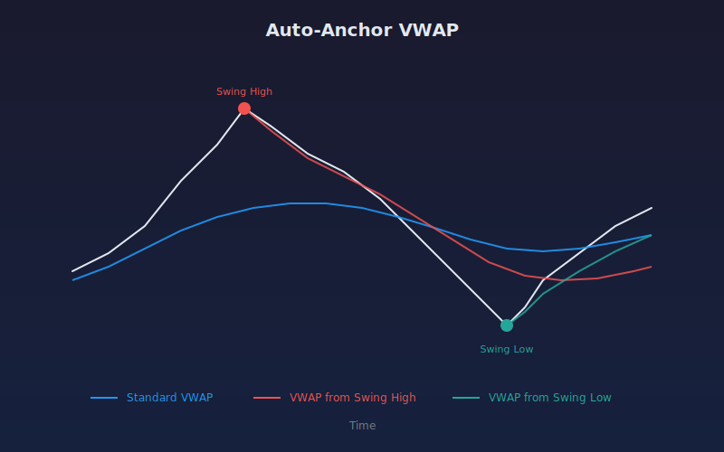

## Auto Anchor VWAP

Plots three VWAPs simultaneously: a standard VWAP from the start of data, a VWAP anchored from the most recent swing high, and a VWAP anchored from the most recent swing low. Anchor points are detected automatically using swing point analysis, showing how volume-weighted price behaves from different trend perspectives.

### Parameters

- **Swing Length**: Number of bars on each side to confirm a swing point (default: 10)
- **Show Standard VWAP**: Toggle the full-range VWAP line (default: on)
- **Show Anchored VWAPs**: Toggle the swing-anchored VWAP lines (default: on)

### Plot Colors

- **Blue**: Standard VWAP from start of data
- **Red**: VWAP anchored from the most recent swing high
- **Green**: VWAP anchored from the most recent swing low

### How It Works

1. Standard VWAP is calculated as cumulative(volume * typical price) / cumulative(volume) across all bars.
2. Swing highs are bars where the high is greater than the highs of all surrounding bars within the swing length window.
3. Swing lows are bars where the low is less than the lows of all surrounding bars within the swing length window.
4. Anchored VWAPs restart the cumulative calculation from each detected anchor point forward.
5. Small labels ("SH" and "SL") mark the detected anchor points on the chart.

## Conceptual Diagram

