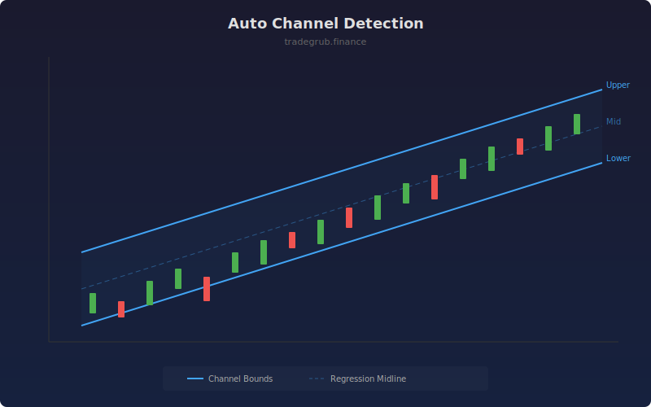

# Auto Channel Detection

Automatically fits parallel regression channels to recent price action using linear regression. The channel boundaries adapt dynamically as new bars arrive, providing objective trend channel analysis without manual drawing.

## How It Works

- Fits a linear regression line through the closing prices over the channel length
- Calculates upper and lower channel boundaries from maximum and minimum residuals
- Width multiplier scales the channel boundaries for tighter or wider bands
- Channel updates on each new bar for a rolling dynamic fit
- Draws the full channel structure on the most recent window

## Parameters

| Parameter | Default | Range | Description |
|-----------|---------|-------|-------------|
| Channel Length | 50 | 20-200 | Number of bars for regression fit |
| Width Multiplier | 1.0 | 0.5-3.0 | Scales channel width from residuals |
| Show Midline | true | - | Display the regression midline |

## Outputs

- **Upper Channel**: Upper parallel boundary line
- **Lower Channel**: Lower parallel boundary line
- **Midline**: Central regression line (optional)

## Usage Notes

- Price touching the upper channel suggests overbought within the trend
- Price touching the lower channel suggests oversold within the trend
- Channel slope indicates trend direction and strength
