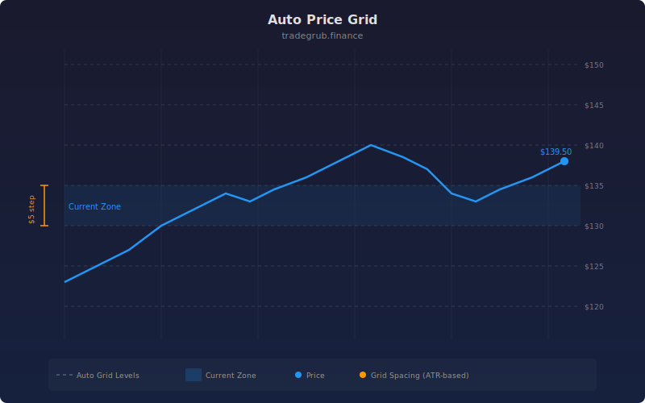

# Auto Price Grid

Automatically plots horizontal grid lines across the visible price range, divided into equal steps. The indicator finds the highest and lowest prices over a configurable lookback period, then draws evenly spaced levels between them. The zone containing the current price is highlighted with a subtle background color.

## Conceptual Diagram

## Inputs

- **Lookback Period**: Number of bars to scan for the high/low range (default 100, range 20 to 500)
- **Grid Levels**: Number of equal divisions between high and low (default 10, range 3 to 20)
- **Show Prices**: Display price labels at each grid level (default on)

## How it works

1. Scans the last N bars to find the highest high and lowest low
2. Divides that range into equal steps
3. Draws a dotted horizontal line at each level
4. Optionally labels each line with its price value
5. Highlights the zone where the current closing price sits

## Use cases

- Quickly visualize where price sits relative to its recent range
- Identify potential support and resistance at evenly spaced intervals
- Use as a reference grid for scaling into or out of positions
