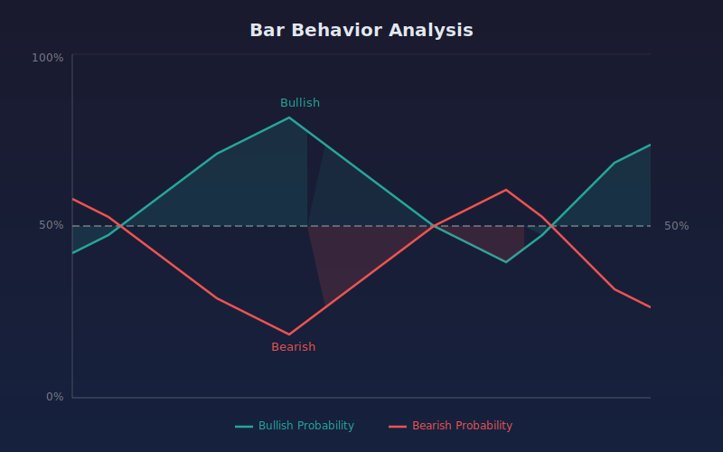

# Bar Behavior Analysis

Statistical analysis of bar behavior showing the probability of bullish or bearish follow-through on subsequent bars.

## Conceptual Diagram

## How It Works

For each bar on the chart, the indicator looks back through historical bars to find bars with similar characteristics (bullish/bearish classification and relative size). It then calculates what happened on the bar immediately following each of those similar bars.

**Bar Classification:**
- Bullish: close is above open by more than 10% of the average range
- Bearish: close is below open by more than 10% of the average range
- Doji: close and open are within 10% of the average range

**Metrics Displayed:**
- Bullish Probability (green line): percentage of similar historical bars that were followed by a bullish bar
- Bearish Probability (red line): percentage of similar historical bars that were followed by a bearish bar
- Follow-Through Strength (gold line): average ratio of body size to range on the following bar, scaled to 0-100

## Inputs

- **Lookback Period** (default 100): number of historical bars to scan for similar patterns
- **Filter by Bar Type** (default true): when enabled, only matches bars of the same type (bullish/bearish/doji) and relative size category (small/medium/large)

## Reading the Indicator

- Values above 50 on the bullish line suggest a statistical lean toward a bullish next bar
- Values above 70 indicate a strong historical tendency
- The follow-through strength line shows how decisive the next bar tends to be
- When both bullish and bearish lines are near 50, the historical data is inconclusive

## Notes

- Requires at least 5 matching bars in the lookback window to produce a signal; otherwise defaults to 50 (neutral)
- Works on any timeframe and instrument
- Past statistical patterns do not guarantee future results
