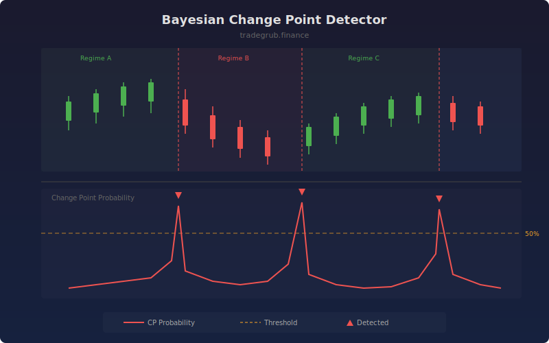

# Bayesian Change Point Detector

Detects structural breaks in price series using Bayesian online changepoint detection. The algorithm continuously estimates the probability that the current bar represents a regime change, helping traders identify shifts in market behavior before traditional indicators react.

## How It Works

- Models price returns using a normal distribution with conjugate prior parameters
- Maintains a distribution over possible run lengths (time since last changepoint)
- At each bar, computes the probability that a new regime has started
- Uses a hazard rate parameter to control prior belief about changepoint frequency
- Signals are generated when changepoint probability exceeds the detection threshold

## Parameters

| Parameter | Default | Range | Description |
|-----------|---------|-------|-------------|
| Hazard Rate | 100 | 10-500 | Expected bars between changepoints (higher = rarer) |
| Detection Threshold | 0.5 | 0.1-0.9 | Minimum probability to flag a changepoint |

## Outputs

- **Change Point Probability**: Probability (0-100%) that a regime change occurred (red line)
- **Threshold**: Detection threshold reference line (orange dashed)
- **Change Point Markers**: Triangle markers where changepoints are detected

## Usage Notes

- Lower hazard rates detect more changepoints; higher values focus on major structural breaks
- Spikes in probability often precede sustained directional moves or volatility shifts
- Combine with volatility indicators to distinguish between trend and volatility regime changes
