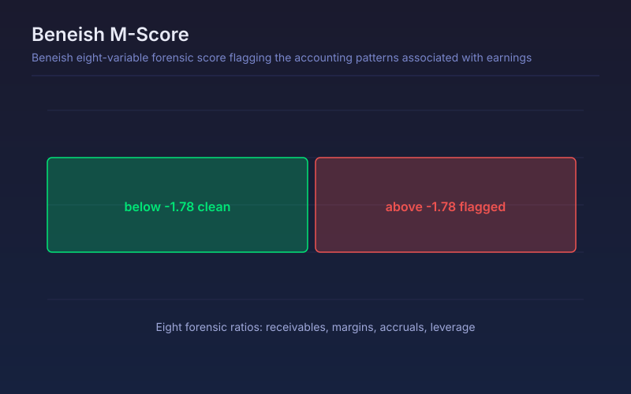

# Beneish M-Score

Beneish eight-variable forensic score flagging the accounting patterns associated with earnings manipulation.

## Conceptual Diagram

## Parameters

| Parameter | Default | Range | Description |
|-----------|---------|-------|-------------|
| Reporting period | FY | FY or FQ | Annual or quarterly statements used for the eight ratios |

## Signals

- M above -1.78: the accounting profile the model associates with manipulated earnings
- M below -1.78: no manipulation profile detected
- A sharp jump in the score at a filing deserves a read of the actual statement, whichever side of the threshold it lands on
- Receivables growing faster than revenue is the dominant driver and is worth checking directly

## Usage

Use as a red-flag screen on any position sized large enough to matter, particularly on high-growth names where accruals do the heavy lifting. The score is evidence to investigate, not a verdict.

## Data Requirements

This script reads filed financial statements through `request.financial()`, so it
needs fundamental data for the charted symbol. On instruments without filed
statements, such as crypto pairs, forex and most indices, the series is empty and
nothing plots. Values step only at each filing date and stay flat in between.
