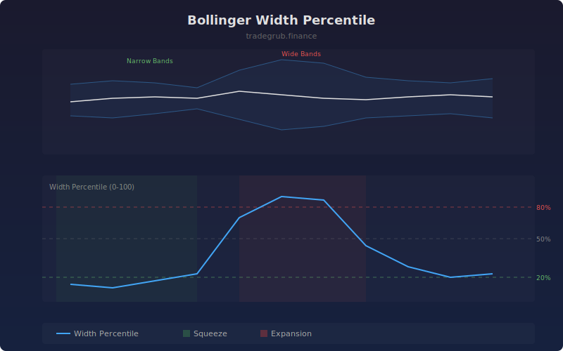

# Bollinger Width Percentile

The Bollinger Width Percentile ranks the current Bollinger Band width against its own historical values, providing a normalized 0-100 reading of relative volatility. This makes it easy to identify when bands are in an extreme squeeze or expansion compared to recent history, regardless of the absolute price level.

## How It Works

- Calculates standard Bollinger Bands (upper, middle, lower)
- Computes bandwidth as a percentage of the middle band
- Ranks the current width against the lookback window to get a percentile
- Low percentile values indicate a squeeze (narrow bands relative to history)
- High percentile values indicate expansion (wide bands relative to history)

## Parameters

| Parameter | Default | Range | Description |
|-----------|---------|-------|-------------|
| BB Length | 20 | 5-200 | Bollinger Band period |
| BB Multiplier | 2.0 | 0.5-5.0 | Standard deviation multiplier |
| Percentile Lookback | 100 | 20-500 | Window for percentile ranking |
| Squeeze Threshold % | 20.0 | 5-50 | Below this is a squeeze |
| Expansion Threshold % | 80.0 | 50-95 | Above this is an expansion |

## Outputs

- **Width Percentile**: Percentile rank of current band width (blue line, 0-100)
- **Background**: Green for squeeze zones, red for expansion zones

## Usage Notes

- Squeeze conditions below 20th percentile often precede strong directional moves
- Expansion readings above 80th percentile may signal trend exhaustion
- Combine with directional indicators to determine breakout direction from squeezes
