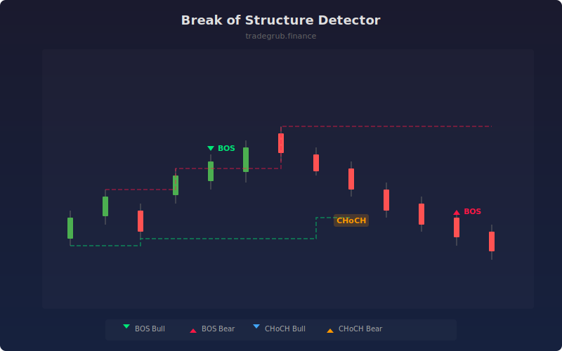

# Break of Structure Detector

The Break of Structure (BOS) Detector identifies market structure shifts by tracking swing highs and lows. It distinguishes between continuation breaks (BOS) and trend reversal breaks (Change of Character / CHoCH), key concepts in institutional order flow analysis.

## How It Works

- Identifies swing highs and lows using a configurable lookback window
- Tracks the prevailing trend direction based on structure
- BOS signals occur when price breaks a swing level in the direction of the existing trend
- CHoCH signals occur when price breaks a swing level against the trend, indicating reversal
- Draws stepped structure lines connecting swing highs and lows

## Parameters

| Parameter | Default | Range | Description |
|-----------|---------|-------|-------------|
| Swing Lookback | 5 | 2-20 | Bars on each side to confirm swing point |
| Show BOS | true | - | Display Break of Structure markers |
| Show CHoCH | true | - | Display Change of Character markers |
| Show Structure Lines | true | - | Draw swing high/low step lines |

## Outputs

- **BOS Bull/Bear**: Green/red triangles for trend continuation breaks
- **CHoCH Bull/Bear**: Blue/orange triangles and labels for reversal breaks
- **Structure Lines**: Stepped lines tracking swing highs (red) and lows (green)

## Usage Notes

- CHoCH signals are higher-probability reversal setups than simple BOS breaks
- Combine with order blocks or fair value gaps for confluence entries
- Increase the swing lookback for higher timeframes to filter noise
