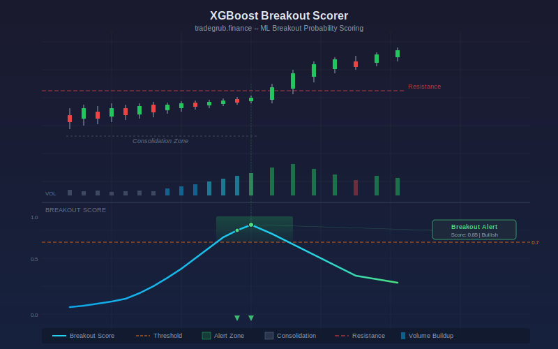

# Breakout Probability Scorer

The XGBoost Breakout Scorer uses gradient boosted decision trees to estimate the probability that a price breakout is imminent. It extracts five features from price and volume data, trains an XGBoost classifier on historically labeled breakout events, and outputs a continuous probability score between 0 and 1. When the score crosses a configurable threshold, the indicator highlights the chart and generates an alert.

## Conceptual Diagram



## How It Works

The indicator engineers five features for each bar: consolidation tightness (how compressed current ATR is relative to the rolling maximum ATR), volume buildup (current volume divided by its moving average), proximity to the recent high and low (where the close sits within the lookback range), and momentum (rate of change over the lookback period). Together, these features capture the classic preconditions for a breakout: narrowing volatility, rising participation, and directional pressure.

Breakout labels are generated automatically by scanning forward from each bar. If price moves beyond the consolidation range by more than the configurable threshold percentage within the lookback window, that bar is labeled as a breakout event. The XGBoost classifier trains on these labeled samples and then scores every bar with a breakout probability.

A direction bias annotation accompanies each alert. When price sits in the upper portion of the consolidation range the bias reads "Bullish," when in the lower portion it reads "Bearish," and otherwise "Neutral." This gives a quick read on which side of the range the breakout is more likely to occur.

## Parameters

| Parameter | Default | Description |
|---|---|---|
| ATR Length | 14 | Period for Average True Range calculation |
| Lookback Period | 20 | Window for feature calculations and breakout labeling |
| Breakout Threshold % | 2.0 | Minimum price move beyond range to label as breakout |
| XGB Estimators | 100 | Number of boosting rounds for the XGBoost model |
| Score Threshold | 0.7 | Probability level that triggers alerts and background highlighting |
| Show Labels | True | Display text labels on chart when alerts fire |
| Label Cooldown Bars | 10 | Minimum bars between consecutive labels to reduce clutter |

## Signals

**Breakout Score Line:** A continuous value between 0 and 1 plotted in the sub-pane. Higher values indicate a greater probability of an imminent breakout based on the trained model.

**Threshold Crossing:** When the score exceeds the threshold (default 0.7), the background highlights green and a triangle marker appears. This is the primary alert condition.

**Direction Bias Labels:** Each alert label includes a direction annotation. "Bullish" means price is near the top of its consolidation range, suggesting an upward breakout is more likely. "Bearish" means price is near the bottom. "Neutral" means price is centered.

**Score Interpretation:**
- 0.0 to 0.3: Low breakout probability, market likely ranging normally
- 0.3 to 0.7: Moderate probability, consolidation may be forming
- 0.7 to 1.0: High probability, breakout conditions are present

## Python Advantage

The XGBoost model requires Python libraries that are not available in Pine. The `tg_scripting` framework makes this possible while keeping the familiar indicator workflow:

```python
from xgboost import XGBClassifier

model = XGBClassifier(n_estimators=100, max_depth=4, learning_rate=0.1)
model.fit(features[train_idx], breakout_labels[train_idx])
breakout_score = model.predict_proba(features)[:, 1]
```

This trains a full gradient boosted classifier directly within the indicator, something that would require an external service in other charting platforms.

## Usage Notes

- The model trains on historical data within the visible chart window. Longer chart histories provide more training samples and generally improve accuracy.
- The default 80/20 train/test split means the model scores recent bars on data it has not trained on, reducing overfitting on the most actionable signals.
- If xgboost is not installed, the indicator falls back to a weighted heuristic score using the same five features.
- Adjust the Breakout Threshold % based on the asset's typical volatility. Higher values suit volatile instruments, lower values suit stable ones.
- The Label Cooldown setting prevents alert spam during sustained high-probability zones.

## Risk Management

No probability score guarantees a breakout will occur. False positives are common, especially in choppy or trending markets where the consolidation pattern is ambiguous. Always combine breakout scores with stop-loss levels and position sizing rules. The score reflects statistical conditions, not certainty. Backtest across multiple timeframes and instruments before relying on the indicator for live decisions.

## Combining with Other Indicators

- **Volume Profile:** Confirm that the breakout zone aligns with a high-volume node or point of control for stronger conviction.
- **Bollinger Bands:** A Bollinger Band squeeze occurring simultaneously with a high breakout score adds confluence to the consolidation signal.
- **RSI Divergence:** Look for RSI divergence alongside rising breakout scores to filter for higher-quality setups.
- **Support/Resistance Levels:** Overlay key horizontal levels to identify the price barriers the predicted breakout must clear.
