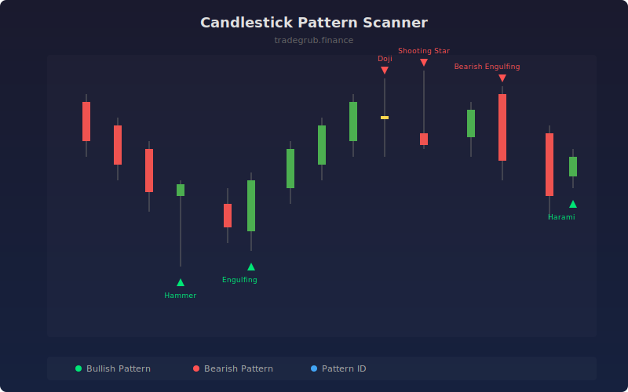

# Candlestick Pattern Scanner

Automatically scans for classic candlestick reversal and continuation patterns across any timeframe. Detects doji, engulfing, hammer, shooting star, harami, and more with configurable sensitivity and toggleable pattern groups.

## How It Works

- Analyzes body size, wick lengths, and ratios for each candle relative to its total range
- Compares current and prior candles to identify multi-bar patterns like engulfing and harami
- Checks trend context (prior candle direction) to validate pattern significance
- Marks bullish patterns below bars and bearish patterns above bars
- Outputs a pattern ID value for programmatic use in strategy building

## Parameters

| Parameter | Default | Range | Description |
|-----------|---------|-------|-------------|
| Show Doji | true | - | Toggle doji pattern detection |
| Show Engulfing | true | - | Toggle engulfing pattern detection |
| Show Hammer/Hanging Man | true | - | Toggle hammer and hanging man detection |
| Show Shooting/Morning Star | true | - | Toggle star pattern detection |
| Show Harami | true | - | Toggle harami pattern detection |
| Doji Body Ratio | 0.1 | 0.01-0.3 | Maximum body-to-range ratio for doji classification |

## Outputs

- **Bullish Pattern**: Green triangle markers below bars for bullish patterns
- **Bearish Pattern**: Red triangle markers above bars for bearish patterns
- **Pattern ID**: Numeric identifier for each detected pattern type

## Usage Notes

- Patterns are most reliable at key support/resistance levels and after extended moves
- Combine with volume confirmation for higher probability signals
- Adjust the doji body ratio for different instrument volatility profiles
