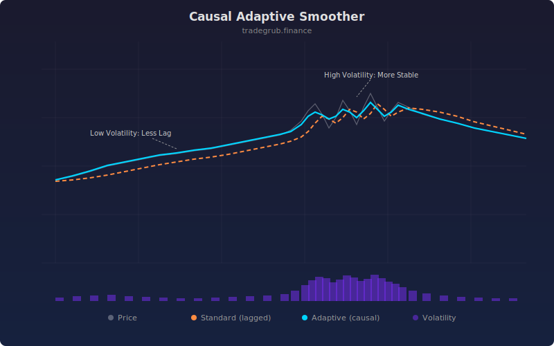

# Causal Adaptive Smoother

An adaptive exponential filter that automatically adjusts its smoothing factor based on current volatility. Responds faster in calm markets and smooths more aggressively during volatile periods.

## How It Works

- Computes ATR-based volatility ratio (current ATR vs average ATR)
- Derives adaptive alpha: faster smoothing when volatility is below average, slower when above
- Applies a causal exponential filter using the time-varying alpha
- Colors the output line green when rising, red when falling

## Parameters

| Parameter | Default | Range | Description |
|-----------|---------|-------|-------------|
| Base Length | 20 | 5-100 | Base period for EMA alpha and ATR calculation |
| Sensitivity | 1.5 | 0.1-5.0 | How strongly volatility affects the smoothing factor |

## Signals

- **Green line**: Smoother is rising (bullish bias)
- **Red line**: Smoother is falling (bearish bias)
- Direction changes can serve as trend reversal signals

## Usage Notes

- Higher sensitivity makes the smoother more reactive to volatility changes
- Compare with a standard EMA to see the lag reduction in trending, low-volatility moves
- Works well as a dynamic trailing stop reference
