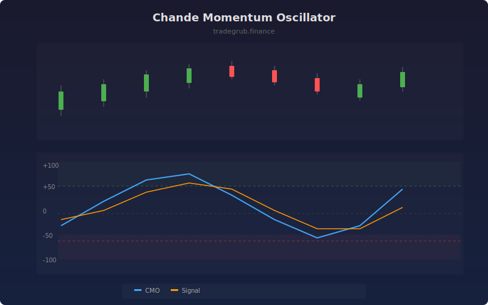

# Chande Momentum Oscillator

The Chande Momentum Oscillator (CMO) measures momentum by calculating the difference between the sum of gains and sum of losses over a period, divided by their total. Unlike RSI, CMO uses both up and down movements in the numerator, providing a symmetric oscillator ranging from -100 to +100.

## How It Works

- Sums all positive closes (gains) over the lookback period
- Sums all negative closes (losses) over the lookback period
- Computes CMO as 100 * (gains - losses) / (gains + losses)
- Adds a signal line using an EMA of the CMO for crossover analysis
- Values oscillate between -100 (all losses) and +100 (all gains)

## Parameters

| Parameter | Default | Range | Description |
|-----------|---------|-------|-------------|
| Period | 14 | 2-100 | Lookback period for momentum calculation |
| Overbought | 50 | 20-80 | Upper threshold level |
| Oversold | -50 | -80 to -20 | Lower threshold level |
| Signal Length | 9 | 2-30 | EMA period for signal line |

## Outputs

- **CMO**: Main oscillator line (-100 to +100, blue)
- **Signal**: EMA signal line (orange)
- **Overbought/Oversold**: Horizontal threshold lines
- **Background**: Shading in extreme zones

## Usage Notes

- CMO at +100 means every bar closed higher, at -100 every bar closed lower
- The symmetric scale makes it useful for comparing bullish and bearish momentum directly
- CMO crossing above its signal line after oversold readings can indicate buying opportunities
