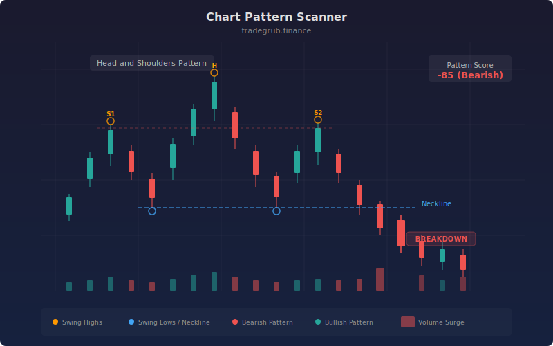

# Chart Pattern Scanner

Automated detection of classical chart patterns by analyzing swing highs and swing lows with numpy-powered geometry. The scanner identifies double tops, double bottoms, head and shoulders formations, ascending and descending triangles, and wedge patterns. It uses turning point detection via first-difference sign analysis, linear regression for trendline slope calculation, and tolerance-based geometric comparison to match price structures against known pattern templates.

## Conceptual Diagram



## How It Works

The scanner begins with swing point detection. It computes first differences of the high and low series using np.diff, then applies np.sign to determine directional movement. Sign changes from positive to negative identify potential swing highs, while negative to positive changes identify swing lows. Each candidate is then confirmed by checking that it is the highest (or lowest) value within a neighborhood window, eliminating noise-induced false pivots.

Once confirmed swing points are extracted, the scanner runs four independent pattern detectors. The double top detector compares consecutive swing highs and checks whether their price levels fall within the tolerance threshold. If two peaks are at similar levels with a meaningful valley between them, a bearish double top is flagged. The double bottom detector applies the same logic inverted on swing lows. The head and shoulders detector examines three consecutive swing highs, verifying that the middle peak exceeds both shoulders and that the two shoulders are approximately equal in height.

Triangle and wedge detection uses np.polyfit linear regression on recent swing high and swing low sequences to calculate trendline slopes. An ascending triangle is identified when swing highs have a near-flat slope while swing lows have a rising slope. A descending triangle shows the inverse pattern. Wedges are detected when both trendlines converge -- a falling wedge (bullish) has both slopes declining with the upper slope steeper, while a rising wedge (bearish) has both slopes ascending with the lower slope steeper.

All pattern signals are combined into a composite score. Positive scores indicate bullish patterns (double bottoms, ascending triangles, falling wedges), negative scores indicate bearish patterns (double tops, descending triangles, head and shoulders, rising wedges). The magnitude reflects the pattern's geometric clarity. Trendlines from the most recent polyfit are projected forward and drawn on the chart.

The pattern score is smoothed with a short SMA to reduce single-bar noise, and background highlighting activates when the absolute score exceeds 30, providing an at-a-glance view of where the scanner has identified high-confidence structural formations.

## Parameters

| Parameter | Default | Range | Description |
|-----------|---------|-------|-------------|
| Swing Detection Length | 5 | 2-20 | Neighborhood radius for confirming swing points |
| Pattern Lookback Bars | 100 | 30-300 | Maximum bar span for a valid pattern |
| Pattern Tolerance | 0.02 | 0.005-0.10 | Price similarity threshold as decimal percentage |
| Min Swings for Pattern | 5 | 3-10 | Minimum swing points required before scanning |
| Show Trendlines | true | -- | Toggle trendline overlay on price chart |

## Python Advantage

The swing detection and pattern matching logic requires array-level operations that cannot be expressed in Pine:

```python
# Turning point detection via vectorized sign-change analysis
high_diff = np.diff(high)
high_sign = np.sign(high_diff)
high_sign_change = np.diff(high_sign)
swing_high_raw = np.pad(high_sign_change == -2, (2, 0), constant_values=False)

# Trendline slope via linear regression on swing sequences
sh_coeff = np.polyfit(sh_indices.astype(float), sh_values, 1)
sl_coeff = np.polyfit(sl_indices.astype(float), sl_values, 1)
resistance_projected = np.polyval(sh_coeff, np.arange(start_bar, n, dtype=float))

# Pattern matching with vectorized tolerance comparison
price_diff = np.abs(sh_val[i] - sh_val[i+1]) / sh_val[i]
if price_diff < tolerance:  # geometric similarity check
```

The np.diff/np.sign chain for turning point detection, np.polyfit for regression-based trendlines, np.pad for array alignment, and np.polyval for projection are all numpy operations with no Pine equivalents. Pine would require manual bar-by-bar loops with limited lookback, making multi-pattern scanning impractical.

## When to Use

Chart pattern scanning is most effective on daily and weekly charts where patterns develop over 20-100 bars. It works well on liquid equities, ETFs, forex pairs, and futures where classical technical patterns have the strongest statistical edge. Use shorter swing lengths (2-3) on intraday charts and longer lengths (8-15) on weekly charts. Reduce tolerance on lower-volatility instruments and increase it on commodities or crypto.

## Risk Management

Patterns are probabilistic, not deterministic. A detected double top completes only when price breaks below the intervening valley (neckline). Always wait for neckline confirmation before entering. Set stop-losses just beyond the pattern's extreme (above the double top peaks, below the head and shoulders neckline). Measure the pattern's height for a price target projection. The scanner detects forming patterns, which means some will fail to complete; the pattern score magnitude helps filter for higher-confidence setups.

## Combining with Other Indicators

- Use with volume indicators (OBV, CMF) to confirm pattern breakouts with volume expansion
- Pair with the Neural Weight Oscillator to verify that the dominant regime supports the pattern's directional bias
- Combine with Fibonacci Bands to identify confluence between pattern targets and Fibonacci retracement levels
