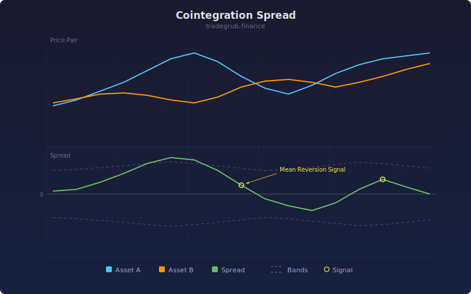

# Spread Analyzer

Analyzes the spread between price and its linear regression fit to identify mean-reversion opportunities. Uses numpy lstsq for regression and a variance ratio test for stationarity confirmation.

## How It Works

- Fits a linear regression to price over a rolling lookback window using numpy lstsq
- Computes residual spread (price minus fitted value)
- Normalizes spread into a z-score using rolling mean and standard deviation
- Variance ratio test checks whether the spread is mean-reverting
- Signals fire when z-score crosses the +/-2 standard deviation bands

## Parameters

| Parameter | Default | Range | Description |
|-----------|---------|-------|-------------|
| Lookback | 100 | 30-500 | Rolling window for regression and spread calculation |

## Signals

- **Green triangle at bottom**: Z-score below -2, mean-reversion buy signal
- **Red triangle at top**: Z-score above +2, mean-reversion sell signal
- **Cyan line**: Z-score of the regression residual
- **Red/green dashed lines**: +/-2 standard deviation bands

## Usage Notes

- Larger lookback produces smoother regression and fewer signals
- Best on instruments that oscillate around a trend rather than trending strongly
- Variance ratio near 1.0 suggests random walk; below 1.0 suggests mean-reversion
