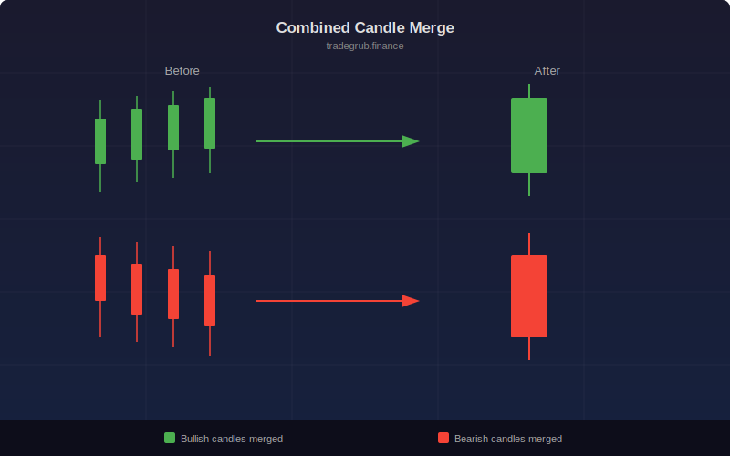

# Combined Candle Merge

Visually merges consecutive same-direction candles (all bullish or all bearish) into a single aggregate bar overlay. Shows the combined open-to-close range as a box with optional wick lines at the merged high and low. Labels display how many candles were merged.

## Conceptual Diagram

## Parameters

- **Min Candles to Merge** (2-10, default 2): Minimum run length to trigger a merge
- **Show Merged Wicks** (default on): Draw wick lines from the box to the merged high/low

## Signals

- **Green boxes**: Consecutive bullish candles merged, showing net upward move
- **Red boxes**: Consecutive bearish candles merged, showing net downward move
- **Count labels**: Number of candles in each merged group
- Long runs with small net movement reveal indecision despite directional bars

## Use Cases

- Simplify chart noise by viewing net directional moves
- Identify strong momentum runs (many candles, large box)
- Spot weak runs where many bars produce little net movement
