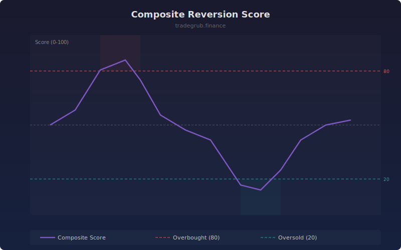

# Composite Reversion Score

Blends three independent mean-reversion signals into a single composite score from 0 to 100. Above 80 indicates overbought conditions; below 20 indicates oversold conditions.

## How It Works

- **Momentum Percentile**: Percentile rank of the current bar-to-bar rate of change against the lookback window
- **Streak Score**: Consecutive up or down bar count, normalized to 0-100
- **Return Percentile**: Percentile rank of the 10-bar return against the lookback window
- Composite is the simple average of all three components

## Parameters

| Parameter | Default | Range | Description |
|-----------|---------|-------|-------------|
| Lookback | 50 | 10-200 | Rolling window for percentile calculations |

## Outputs

- **Composite Score**: Purple line from 0 to 100
- **Overbought**: Red dashed line at 80
- **Oversold**: Green dashed line at 20
- **Neutral**: Gray line at 50
- **Background**: Red shading above 80, green shading below 20

## Usage Notes

- Readings above 80 suggest the price is extended to the upside and may revert
- Readings below 20 suggest the price is extended to the downside and may bounce
- The composite approach reduces false signals from any single metric
- Works best in range-bound markets; strong trends can sustain extreme readings
