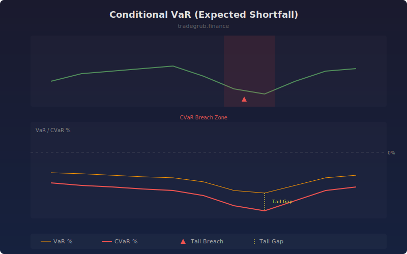

# Conditional VaR (Expected Shortfall)

Conditional Value at Risk, also known as Expected Shortfall, measures the average loss in the worst-case scenarios beyond the VaR threshold. While VaR tells you the boundary of normal losses, CVaR answers the critical question of how bad things get when they go wrong, making it essential for tail risk management.

## How It Works

- Computes log returns over the lookback window
- Sorts returns and identifies the VaR cutoff at the specified confidence level
- Calculates CVaR as the mean of all returns worse than the VaR threshold
- CVaR is always more negative than VaR, reflecting the severity of tail events
- Flags bars where actual returns breach the CVaR level

## Parameters

| Parameter | Default | Range | Description |
|-----------|---------|-------|-------------|
| Lookback Length | 60 | 20-500 | Number of bars for return distribution |
| Confidence % | 95.0 | 90.0-99.9 | Confidence level for calculations |

## Outputs

- **VaR %**: Value at Risk boundary (orange line)
- **CVaR %**: Expected Shortfall / average tail loss (red line)
- **Tail Breach**: Markers when actual loss exceeds CVaR

## Usage Notes

- The gap between VaR and CVaR indicates how fat the left tail of returns is
- A widening CVaR relative to VaR suggests increasing tail risk
- Use for position sizing: allocate less to assets with extreme CVaR values
