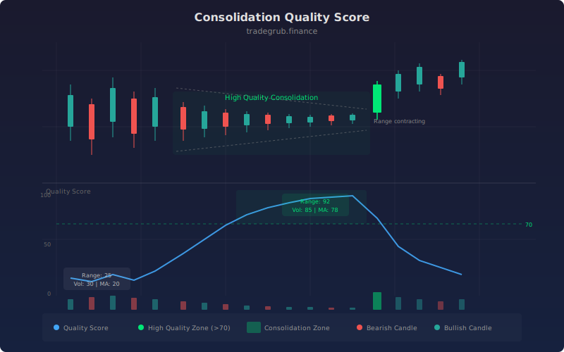

# Consolidation Quality Score

The Consolidation Quality Score measures how orderly and constructive a price consolidation is. It combines three independent factors: range contraction rate, volume decline, and moving average convergence into a single normalized score from 0 to 100. Higher scores indicate tighter, quieter consolidations that often precede directional moves.

## Conceptual Diagram



## How It Works

The indicator evaluates consolidation quality through three components. **Range contraction** compares the current high-low range over the lookback period to the prior equivalent period. A shrinking range signals that volatility is compressing, which is a hallmark of constructive consolidation.

**Volume decline** measures current volume against its moving average. When volume drops below average during a consolidation, it suggests sellers are exhausted and supply is drying up. This "volume dry-up" pattern frequently precedes breakout moves.

**Moving average convergence** tracks how close the fast and slow EMAs are relative to their recent maximum spread. When moving averages converge, it confirms that price is coiling rather than trending. Each component produces a 0-100 sub-score, and the final quality score is a user-configurable weighted average of all three.

## Parameters

| Name | Default | Range | Description |
|------|---------|-------|-------------|
| Lookback Length | 20 | 5-100 | Period for measuring range contraction |
| Volume MA Length | 20 | 5-100 | Period for the volume moving average baseline |
| Fast MA | 10 | 5-50 | Fast EMA period for convergence measurement |
| Slow MA | 30 | 10-100 | Slow EMA period for convergence measurement |
| Range Weight | 0.4 | 0.0-1.0 | Weight applied to the range contraction component |
| Volume Weight | 0.3 | 0.0-1.0 | Weight applied to the volume decline component |
| MA Convergence Weight | 0.3 | 0.0-1.0 | Weight applied to the MA convergence component |
| Quality Threshold | 70 | 0-100 | Score level that triggers background highlighting |
| Highlight Quality Zones | True | on/off | Toggle background color for high-quality zones |

## Python Advantage

The vectorized approach processes all three sub-scores across the entire dataset in a single pass:

```python
range_contraction = np.where(prev_range > 0, (1 - current_range / prev_range) * 100, 0)
range_score = np.clip(range_contraction, 0, 100)

vol_ratio = np.where(vol_ma > 0, volume / vol_ma, 1.0)
vol_decline = (1 - np.clip(vol_ratio, 0, 2) / 2) * 100

quality = (range_score * range_wt + vol_score * vol_wt + ma_score * ma_wt) / total_wt
```

Using `np.where` and `np.clip` avoids per-bar loops entirely, keeping computation fast even on large datasets.

## When to Use

Apply this indicator when scanning for stocks in the late stages of a base or flag pattern. A score above 70 that persists for several bars indicates the consolidation is orderly and worth monitoring for a breakout trigger. Combine the quality score with a volume surge detection or range expansion signal to time entries after the consolidation resolves.

## Risk Management

A high quality score does not guarantee a breakout or its direction. Always define risk with a stop loss placed below the consolidation low for long setups or above the consolidation high for shorts. Position size according to the width of the consolidation range, as tighter ranges allow closer stops and larger relative positions.

## Combining with Other Indicators

- **ATR or Bollinger Bands:** Confirm that volatility is at multi-period lows when the quality score is elevated, adding conviction to the consolidation thesis.
- **RSI or Stochastic:** A neutral RSI reading (40-60) alongside a high quality score reinforces that the stock is coiling rather than overbought or oversold.
- **Volume Profile:** Identify the point of control within the consolidation range to anticipate where price is most likely to break from.
