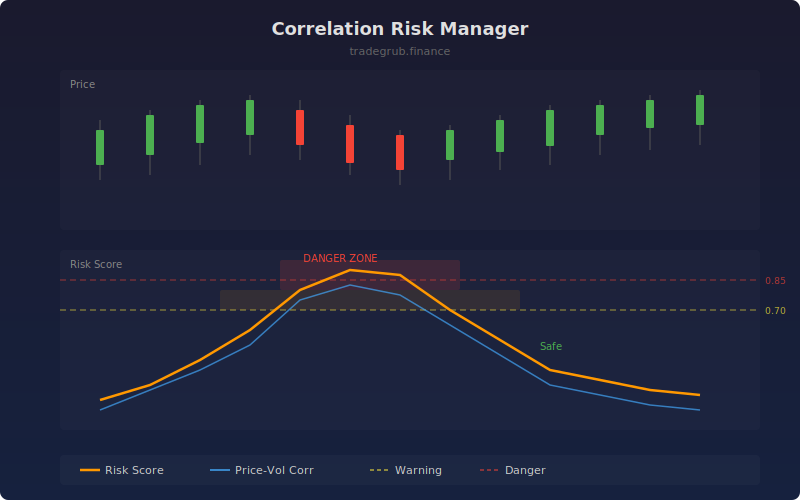

# Correlation Risk Manager

Monitors rolling correlation between price returns and volume changes alongside return autocorrelation to gauge directional concentration risk. The composite risk score highlights periods where price action becomes dangerously correlated, signaling reduced diversification benefit.

## How It Works

- Calculates rolling Pearson correlation between price returns and volume changes over the lookback window
- Computes return autocorrelation as a proxy for momentum concentration risk
- Blends both measures into a composite risk score (60% price-volume correlation, 40% autocorrelation)
- Smooths the score with a 5-bar SMA and flags warning and danger zones via background shading

## Parameters

| Parameter | Default | Range | Description |
|-----------|---------|-------|-------------|
| Lookback Length | 30 | 10-100 | Rolling window for correlation calculation |
| Warning Threshold | 0.70 | 0.30-0.95 | Risk score level triggering warning zone |
| Danger Threshold | 0.85 | 0.50-0.99 | Risk score level triggering danger zone |

## Outputs

- **Risk Score**: Composite correlation risk score (0 to 1), orange line
- **Price-Volume Corr**: Raw rolling correlation between returns and volume, blue line
- **Warning Level**: Horizontal dashed yellow line at warning threshold
- **Danger Level**: Horizontal dashed red line at danger threshold
- **Background**: Green (safe), orange (warning), red (danger) shading

## Usage Notes

- When the risk score exceeds the danger threshold, consider reducing position size or avoiding new entries in the same direction
- Low risk scores indicate uncorrelated price action, suggesting normal diversification benefit
- Works on any timeframe but longer lookback periods produce smoother, more reliable readings
