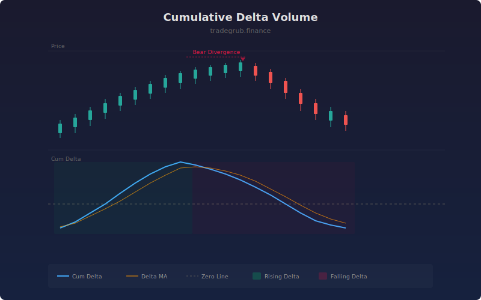

# Cumulative Delta Volume

Tracks the running total of estimated buy versus sell volume to reveal hidden buying or selling pressure beneath the surface of price action. By comparing the cumulative delta trend to price direction, traders can identify divergences that precede reversals.

## How It Works

- Estimates buy volume as the proportion of the bar's range closed from the low (close-low / range).
- Estimates sell volume as the proportion closed from the high (high-close / range).
- Computes delta as buy volume minus sell volume on each bar.
- Accumulates delta into a running cumulative total.
- Applies optional smoothing and a moving average for trend reference.
- Detects divergences where price and cumulative delta disagree on direction.

## Parameters

| Parameter | Default | Range | Description |
|-----------|---------|-------|-------------|
| Smoothing Length | 5 | 1-20 | Smoothing applied to the cumulative delta line |
| Show Zero Line | true | on/off | Display the zero reference line |
| Show Moving Average | true | on/off | Display the delta moving average |
| MA Length | 14 | 5-50 | Period for the delta moving average |

## Outputs

- **Cum Delta**: Main cumulative delta line (blue)
- **Delta MA**: Moving average of cumulative delta (orange)
- **Zero Line**: Horizontal reference at zero
- **Divergence markers**: Triangles when price and delta direction diverge

## Usage Notes

- Rising cumulative delta with rising price confirms bullish momentum.
- Falling cumulative delta while price rises warns of hidden selling pressure (bearish divergence).
- Use divergence signals as early warnings, not standalone entry triggers.
