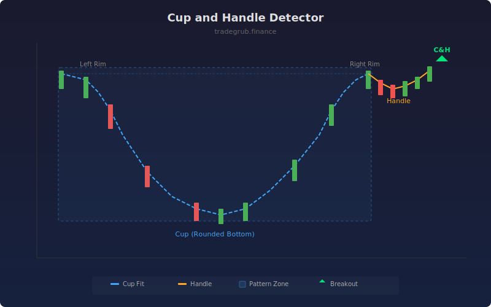

# Cup and Handle Detector

Identifies cup-and-handle continuation patterns by fitting a parabolic curve to potential rounded bottoms. The detector validates rim symmetry, minimum depth, and handle proportions to filter for high-quality patterns.

## How It Works

- Scans a rolling window for U-shaped price segments using parabolic curve fitting
- Validates that left and right rims are within 3% of each other for symmetry
- Checks that the cup depth exceeds the minimum percentage threshold
- Confirms the handle retracement is shallow (less than 50% of cup depth)
- Highlights breakout signals when price clears the handle high

## Parameters

| Parameter | Default | Range | Description |
|-----------|---------|-------|-------------|
| Cup Length | 30 | 10-100 | Number of bars for the cup formation |
| Handle Length | 10 | 3-30 | Number of bars for the handle portion |
| Min Depth % | 5.0 | 1.0-20.0 | Minimum cup depth as percentage of rim price |
| Show Labels | true | - | Display breakout labels on chart |

## Outputs

- **Cup Score**: Binary plot showing detected cup-and-handle patterns
- **Box Overlay**: Highlights the cup region on the price chart
- **C&H Labels**: Marks breakout points above the handle

## Usage Notes

- Larger cup lengths detect more significant patterns on higher timeframes
- Patterns are strongest when volume increases on the breakout above the handle
- Works on any market; adjust depth percentage for different volatility regimes
