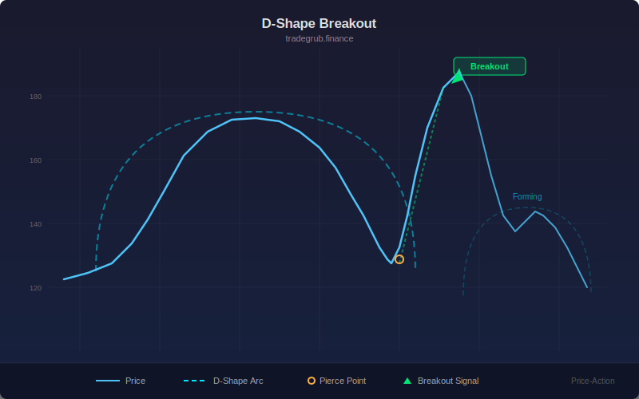

# Arc Breakout Signals

Draws semi-circular arcs from swing highs and lows to create curved support and resistance zones. When price breaks through an arc, a breakout signal is generated.

## How It Works

- Detects swing highs and lows using a rolling window comparison
- Projects semicircular arcs forward from each swing point using parametric coordinates
- Resistance arcs curve above swing highs, support arcs curve below swing lows
- Breakout signals fire when price penetrates an active arc level

## Parameters

| Parameter | Default | Range | Description |
|-----------|---------|-------|-------------|
| Swing Length | 10 | 3-50 | Bars on each side to confirm a swing point |
| Arc Bars | 20 | 5-60 | Number of bars the arc extends forward |

## Signals

- **Green triangle below bar**: Price broke above a resistance arc (bullish breakout)
- **Red triangle above bar**: Price broke below a support arc (bearish breakout)
- **Red arc lines**: Resistance arcs from swing highs
- **Green arc lines**: Support arcs from swing lows

## Usage Notes

- Larger swing length produces fewer but more significant arc levels
- Arc bars controls how far the curved zone extends into the future
- Works best on trending markets where breakouts lead to continuation
