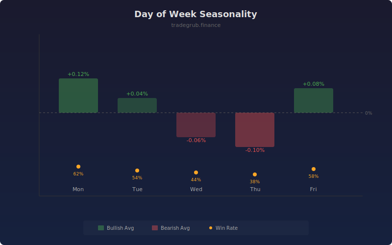

# Day of Week Seasonality

Tracks return patterns by day-of-week position within a repeating cycle. By aggregating historical returns for each day position, it reveals recurring directional bias that can inform timing decisions.

## How It Works

- Groups bars by their position within a configurable cycle length (default 5 for trading days)
- Calculates the average return for bars at the same cycle position over the lookback
- Computes win rate as the percentage of positive returns at each position
- Flags bullish or bearish bias when average returns exceed a threshold
- Background shading highlights days with consistent directional tendency

## Parameters

| Parameter | Default | Range | Description |
|-----------|---------|-------|-------------|
| Cycle Length | 5 | 3-10 | Number of bars in each repeating cycle |
| Lookback Bars | 100 | 20-500 | Historical bars to sample for each position |
| Show Win Rate | true | - | Display the win rate percentage line |

## Outputs

- **Day Avg Return %**: Average return for the current cycle position
- **Win Rate %**: Percentage of positive returns at this position
- **Background**: Green for bullish bias, red for bearish bias

## Usage Notes

- Default cycle of 5 maps to Monday through Friday on daily charts
- Win rates consistently above 60% or below 40% suggest meaningful edge
- Combine with other indicators for confirmation before trading seasonality alone
