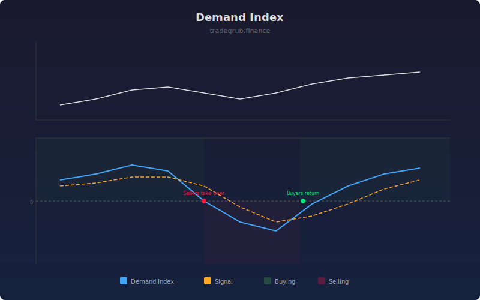

# Demand Index

The Demand Index combines price change direction with relative volume strength to produce a single composite measure of net buying or selling pressure. Positive values indicate buying dominates; negative values indicate sellers are in control.

## How It Works

- Calculates relative volume by comparing current volume to its moving average
- Measures buying pressure as relative volume times positive price changes
- Measures selling pressure as relative volume times negative price changes
- Averages both over the lookback period and computes net percentage
- An EMA signal line provides crossover signals for trend changes

## Parameters

| Parameter | Default | Range | Description |
|-----------|---------|-------|-------------|
| Length | 14 | 2-100 | Lookback period for pressure averaging |
| Smoothing | 5 | 1-20 | EMA period for the signal line |
| Show Signal Line | true | - | Display the EMA signal overlay |

## Outputs

- **Demand Index**: Net buying/selling pressure as a percentage
- **Signal**: EMA of the Demand Index
- **Background**: Green tint for positive (buying), red tint for negative (selling)

## Usage Notes

- Demand Index crossing above zero confirms a shift to buyer dominance
- Divergence between price making new highs and declining Demand Index warns of weakening demand
- Signal line crossovers can be used as entry and exit triggers
