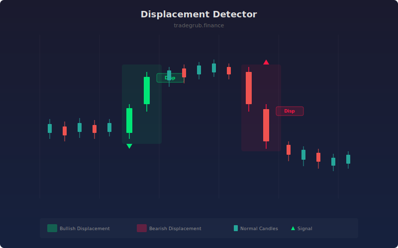

# Displacement Detector

Identifies strong impulsive candle sequences indicating institutional displacement and directional commitment. Displacement occurs when consecutive large-body candles move aggressively in one direction, signaling that institutional participants have committed capital to a directional move.

## How It Works

- Measures each candle's body size relative to ATR to identify abnormally large candles.
- Requires a configurable number of consecutive large-body candles in the same direction.
- Calculates displacement strength as the sum of body sizes across the impulse sequence.
- Marks bullish displacement (consecutive large green candles) and bearish displacement (consecutive large red candles).
- Applies a cooldown between labels to reduce visual clutter.

## Parameters

| Parameter | Default | Range | Description |
|-----------|---------|-------|-------------|
| Body Size Multiplier | 1.5 | 1.0-5.0 | Body must exceed ATR by this factor |
| Consecutive Candles | 2 | 1-5 | Required number of consecutive large candles |
| ATR Length | 14 | 5-50 | ATR calculation period |
| Show Labels | true | on/off | Display displacement labels |

## Outputs

- **Bull Displacement**: Green triangle below bar on bullish impulse sequences
- **Bear Displacement**: Red triangle above bar on bearish impulse sequences
- **Background**: Green/red tint during displacement events
- **Displacement Strength**: Hidden plot of cumulative body size (accessible via data window)

## Usage Notes

- Displacement often creates fair value gaps and order blocks that serve as future support/resistance.
- Look for entries on the retracement following a displacement event, ideally at the OTE zone.
- Higher consecutive candle requirements produce fewer but higher-quality signals.
