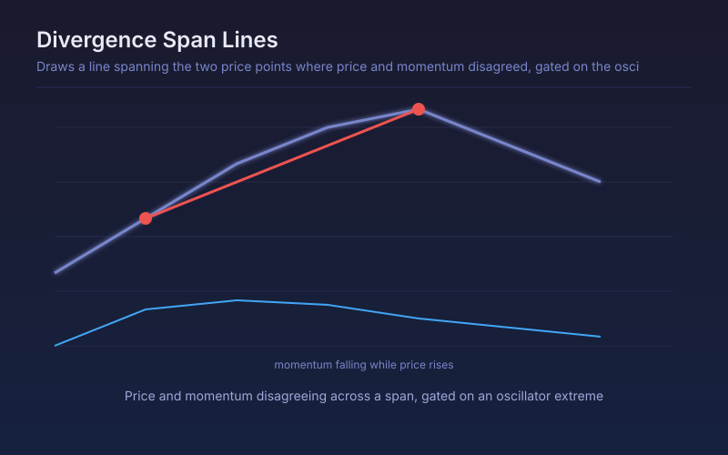

# Divergence Span Lines

Draws a line spanning the two price points where price and momentum disagreed, gated on the oscillator having reached an extreme in between.

## Conceptual Diagram

## Parameters

| Parameter | Default | Range | Description |
|-----------|---------|-------|-------------|
| RSI length | 21 | 2-100 | Oscillator length used for the extreme gate |
| Momentum length | 20 | 2-100 | Lookback for the momentum series compared against price |
| Divergence lookback | 60 | 10-300 | How far back the opposing price extreme is searched for |
| Overbought gate | 70.0 | 50-95 | RSI level that must have been reached inside a bearish span |
| Oversold gate | 30.0 | 5-50 | RSI level that must have been reached inside a bullish span |
| Draw span lines | True | true/false | Draw the line joining the two divergent price points |

## Signals

- Bullish span: price made a lower low than the window's low while momentum made a higher one, with RSI having been oversold in between
- Bearish span: price made a higher high than the window's high while momentum made a lower one, with RSI having been overbought in between
- The drawn line shows exactly which two bars disagreed, which is the part a marker alone hides
- No signal when the oscillator never reached its extreme, however much price and momentum disagreed

## Usage

Use for spotting exhaustion at the end of an extended move, where the span makes it obvious whether the disagreement is between two adjacent swings or two months apart. The extreme gate is what keeps the count low enough to be useful; loosening it produces a signal on almost every swing.
