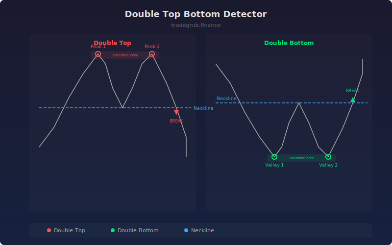

# Double Top Bottom Detector

Automatically identifies double top and double bottom chart patterns with neckline break confirmation. These classic reversal formations signal potential trend changes when price tests a level twice and then breaks through the intermediate neckline.

## How It Works

- Scans a rolling lookback window for two price peaks (double top) or valleys (double bottom) at similar levels
- Requires the two extremes to be within a configurable percentage tolerance of each other
- Enforces a minimum bar gap between the two peaks/valleys to filter out noise
- Identifies the neckline as the trough between tops or peak between bottoms
- Confirms the pattern only when price breaks through the neckline with the required confirmation bars

## Parameters

| Parameter | Default | Range | Description |
|-----------|---------|-------|-------------|
| Lookback Period | 30 | 10-100 | Window to search for pattern formation |
| Price Tolerance % | 1.5 | 0.5-5.0 | Max percentage difference between the two peaks/valleys |
| Min Bars Between Peaks | 5 | 3-30 | Minimum separation between the two extremes |
| Confirmation Bars | 3 | 1-10 | Bars price must hold below/above neckline before signal |

## Outputs

- **Double Top**: Red triangle above bar on confirmed bearish reversal
- **Double Bottom**: Green triangle below bar on confirmed bullish reversal
- **Neckline**: Blue line showing the neckline break level

## Usage Notes

- Wider lookback periods detect larger, more significant formations
- Tighter tolerance (closer to 0.5%) finds more precise double tests
- The measured move target is typically the pattern height projected from the neckline break
