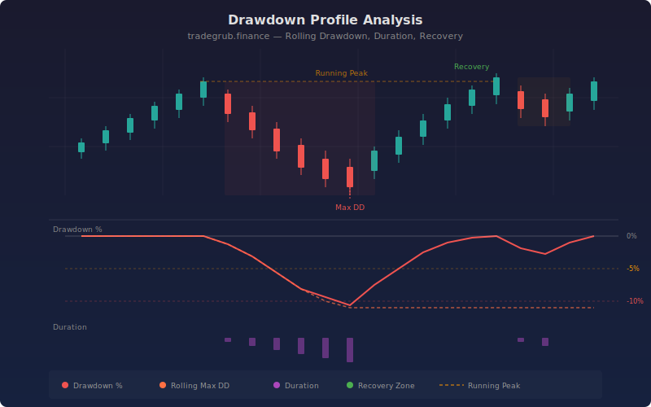

# Drawdown Profile Analysis

A rolling drawdown analysis indicator that computes drawdown depth, duration, and recovery metrics using numpy. The indicator visualizes the complete drawdown profile: current drawdown from peak, rolling maximum drawdown over a configurable window, drawdown duration in bars, and recovery zone markers where price returns to its prior high.

## Conceptual Diagram



## How It Works

The indicator tracks the running peak price and measures the percentage decline from that peak at each bar. This produces a continuous drawdown curve that is always zero or negative: zero when price is at a new high, and negative when price is below its most recent peak.

Rolling maximum drawdown captures the worst drawdown within the lookback window, providing a moving measure of recent downside risk. Drawdown duration counts consecutive bars spent below the peak, quantifying how long capital has been underwater. Recovery markers appear when price returns to its prior peak after a drawdown exceeding 0.5%, showing how frequently and quickly the instrument recovers.

Background shading intensifies with drawdown severity: mild (1% to 5%), moderate (5% to 10%), and severe (beyond 10%). Reference lines at -5%, -10%, and -20% provide quick visual anchors for risk assessment.

## Parameters

| Parameter | Default | Range | Description |
|-----------|---------|-------|-------------|
| Rolling Window | 50 | 10-200 | Lookback period for rolling max drawdown |
| Show Labels | True | on/off | Toggle drawdown and recovery annotations |
| Show Levels | True | on/off | Toggle horizontal reference lines |
| Label Cooldown Bars | 20 | 5-50 | Minimum bars between recovery labels |

## Outputs

- **Drawdown %:** Current percentage decline from the running peak (red line, always zero or negative)
- **Rolling Max DD:** Worst drawdown within the rolling window (orange line)
- **DD Duration:** Consecutive bars spent in drawdown (purple line)
- **Recovery markers:** Green labels marking where price returned to its prior peak
- **Max DD label:** Annotation at the deepest drawdown point in the dataset

## Python Advantage

Numpy enables efficient peak tracking and rolling minimum calculations across the full price history:

```python
peak = close_arr[0]
for i in range(n):
    if close_arr[i] > peak:
        peak = close_arr[i]
    drawdown_pct[i] = (close_arr[i] / peak - 1.0) * 100.0

for i in range(lookback, n):
    max_drawdown_rolling[i] = float(np.nanmin(drawdown_pct[i - lookback:i + 1]))
```

## Usage Notes

- Works on any symbol and timeframe. Daily charts provide the clearest drawdown profiles for swing and position traders.
- Drawdowns beyond -10% on individual stocks are common during corrections. Use the rolling max drawdown to gauge recent risk exposure.
- Recovery markers help identify instruments that bounce back quickly versus those that enter prolonged drawdown periods.
- Combine with position sizing rules: reduce exposure when rolling max drawdown deepens, increase when the instrument demonstrates consistent recovery behavior.
- The indicator is descriptive and measures past drawdowns. It does not predict future drawdowns or guarantee recovery.
