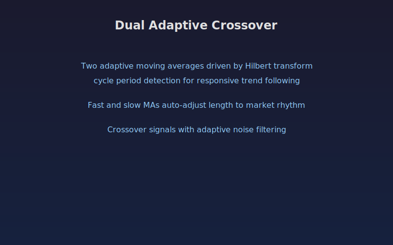

## Dual Adaptive Crossover

Two adaptive moving averages that adjust their smoothing periods based on the dominant market cycle. The indicator uses the Hilbert transform from scipy to estimate instantaneous frequency, converting it to a cycle period that drives the fast and slow MA lengths in real time.

When markets are cycling quickly the MAs tighten and respond faster. In slower trending conditions the MAs widen to filter noise.

### Parameters

- **Fast Period Limit**: minimum allowed adaptive period (default 10)
- **Slow Period Limit**: maximum allowed adaptive period (default 40)
- **Source**: 0 for HL average, 1 for close
- **Smoothing Length**: smoothing applied to the estimated cycle period (default 3)
- **Show Fill**: toggle background shading for trend state
- **Show Labels**: toggle BUY/SELL text labels at crossover points

### Signals

- **Bullish crossover**: fast adaptive MA crosses above slow adaptive MA, green triangle and BUY label
- **Bearish crossover**: fast adaptive MA crosses below slow adaptive MA, red triangle and SELL label
- **Background shading**: green tint during bullish trend, red tint during bearish trend
- **Dominant period line**: shows the estimated cycle period driving the adaptive lengths

Best suited for trending instruments with recognizable cyclical behavior. Pair with volume or momentum filters for confirmation.

## Conceptual Diagram

