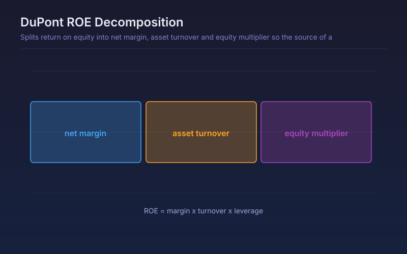

# DuPont ROE Decomposition

Splits return on equity into net margin, asset turnover and equity multiplier so the source of a company's returns is visible.

## Conceptual Diagram

## Parameters

| Parameter | Default | Range | Description |
|-----------|---------|-------|-------------|
| Reporting period | FY | FY or FQ | Annual or quarterly statements used for all three components |

## Signals

- ROE driven mainly by net margin: pricing power or cost advantage
- ROE driven mainly by asset turnover: operational efficiency, typical of retail and distribution
- ROE driven mainly by the equity multiplier: leverage, which flatters returns and magnifies risk
- Stable ROE with a rising multiplier and falling margin is deteriorating quality disguised as consistency

## Usage

Use when comparing two businesses with similar headline ROE, and when judging whether a company's returns are the kind that survive a downturn. The components are scaled to share one pane, so read their shape rather than their absolute heights.

## Data Requirements

This script reads filed financial statements through `request.financial()`, so it
needs fundamental data for the charted symbol. On instruments without filed
statements, such as crypto pairs, forex and most indices, the series is empty and
nothing plots. Values step only at each filing date and stay flat in between.
