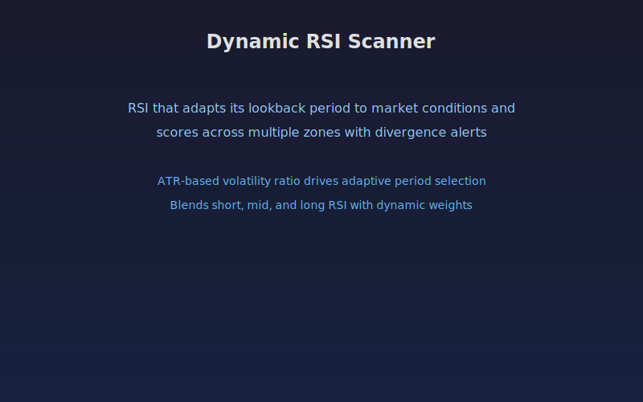

## Dynamic RSI Scanner

An adaptive RSI indicator that automatically adjusts its lookback period based on current volatility conditions. When volatility expands, the RSI shortens for faster response. When volatility contracts, the RSI lengthens for smoother readings.

The indicator blends short, mid, and long RSI calculations using ATR-derived weights, then scores the result across multiple zones from strongly oversold (-2) to strongly overbought (+2). It also detects bullish and bearish divergences between price and the adaptive RSI.

### Parameters

- **Base RSI Period:** starting RSI length before adaptation (default 14)
- **ATR Length:** period for the ATR volatility measurement (default 14)
- **Volatility Fast/Slow MA:** moving average lengths for the volatility ratio (defaults 10/40)
- **Overbought Level:** upper threshold for zone scoring (default 70)
- **Oversold Level:** lower threshold for zone scoring (default 30)
- **Divergence Lookback:** number of bars to scan for divergence patterns (default 20)
- **Show Labels:** toggle divergence labels on or off (default 1)

### Signals

- **Adaptive RSI line** (blue) crossing above/below the signal line (orange) indicates momentum shifts
- **Zone score** (purple) ranges from -2 (deep oversold) to +2 (deep overbought)
- **Background shading** highlights overbought (red) and oversold (green) regions
- **Bull Div / Bear Div labels** appear when price and RSI diverge in oversold or overbought zones
- **Triangle shapes** mark signal line crossovers for quick visual scanning

## Conceptual Diagram

