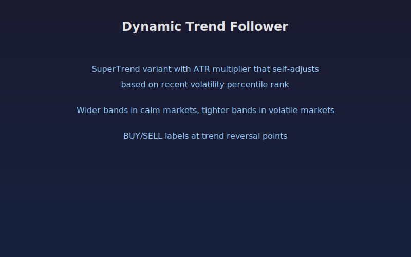

## Dynamic Trend Follower

A volatility-adaptive SuperTrend indicator that automatically adjusts its ATR multiplier based on the rolling percentile rank of recent volatility. In calm markets the bands widen to avoid whipsaws, and in volatile markets the bands tighten to protect gains.

The indicator plots a colored SuperTrend line on the chart with optional background shading and BUY/SELL labels at trend reversals.

### Parameters

- **ATR Length**: period for the ATR calculation (default 14)
- **Base ATR Multiplier**: starting multiplier before adaptation (default 2.5)
- **Volatility Lookback**: number of bars used to compute the volatility percentile rank (default 100)
- **Adaptation Speed**: controls how aggressively the multiplier adjusts (default 0.6)
- **Show Trend Change Labels**: toggle BUY/SELL labels at reversal points
- **Show Background Fill**: toggle green/red background shading for current trend

### Signals

- **BUY**: price closes above the upper SuperTrend band, ending a bearish trend
- **SELL**: price closes below the lower SuperTrend band, ending a bullish trend
- **Green background**: bullish trend in effect
- **Red background**: bearish trend in effect

The adaptive multiplier value is available in the data window for further analysis.

## Conceptual Diagram

