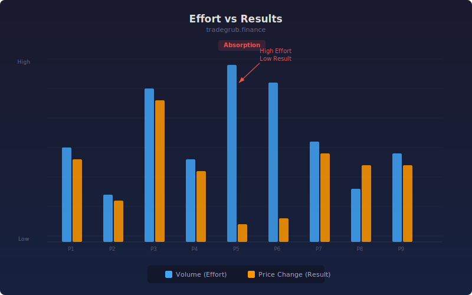

# Effort vs Results Oscillator

Applies the Wyckoff effort-versus-result principle by comparing volume effort to price movement magnitude.

## Conceptual Diagram

## How It Works

- **Effort**: Current volume normalized by its SMA (values above 1 = above-average volume)
- **Result**: Absolute price change normalized by ATR (values above 1 = above-average movement)
- **E/R Ratio**: Result divided by Effort. High ratio means easy movement; low ratio means price is struggling despite effort

## Parameters

- **Length** (default 14): Lookback period for SMA and ATR normalization

## Signals

- **E/R Ratio > 1**: Price moving easily, trend is healthy
- **E/R Ratio < 0.5**: High effort with small results, potential reversal or distribution
- **Divergence**: Effort increasing while E/R ratio falls signals exhaustion
- **Background**: Red tint when ratio drops below 0.5

## Usage

Use to confirm trend strength or spot exhaustion. A strong trend shows high E/R ratio. When volume surges but price barely moves, smart money may be distributing. Combine with price structure analysis.
