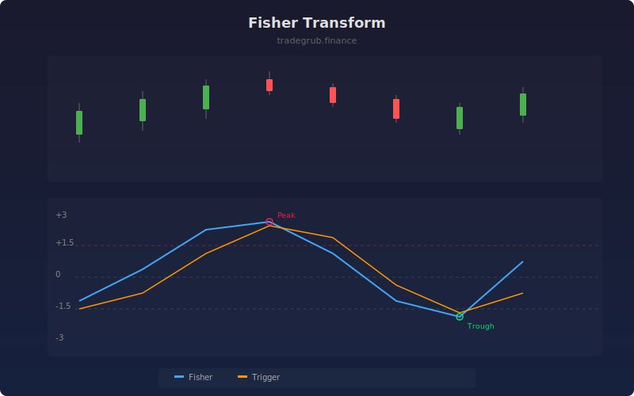

# Fisher Transform

The Fisher Transform applies a mathematical transformation to normalize price data into a near-Gaussian distribution. This produces sharp peaks and valleys that make turning points easier to identify than with conventional oscillators.

## How It Works

- Normalizes the midpoint price (HL2) to a -1 to +1 range using the period's high/low
- Applies the inverse Fisher function: 0.5 * ln((1+x)/(1-x)) to create Gaussian-distributed output
- Uses a one-bar lagged version as a trigger/signal line
- Crossovers between the Fisher line and trigger identify turning points
- Extreme values beyond +/-1.5 indicate overbought/oversold conditions

## Parameters

| Parameter | Default | Range | Description |
|-----------|---------|-------|-------------|
| Period | 10 | 2-50 | Lookback for price normalization |
| Signal Smoothing | 3 | 1-10 | Additional smoothing factor |

## Outputs

- **Fisher**: Main transformed oscillator (blue)
- **Trigger**: One-bar lagged signal line (orange)
- **Reference Lines**: Zero, overbought (+1.5), oversold (-1.5)
- **Markers**: Crossover buy/sell arrows

## Usage Notes

- Fisher values tend to spike sharply at turning points, providing early reversal signals
- Crossovers at extreme levels (above 1.5 or below -1.5) are the highest-probability signals
- The transform works on any timeframe but shorter periods produce more signals with more noise
