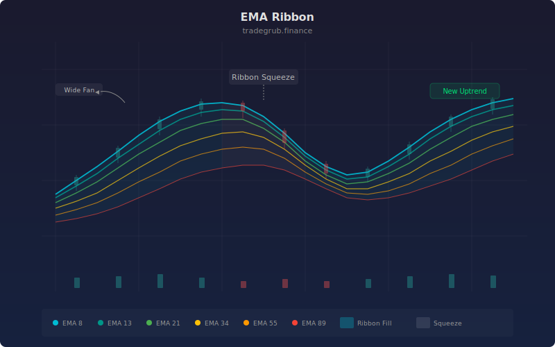

# EMA Ribbon

The EMA Ribbon plots six exponential moving averages at Fibonacci-sequence periods (8, 13, 21, 34, 55, 89) with color-gradient fills between each pair. Originally popularized by Daryl Guppy as the "Guppy Multiple Moving Average," this visualization reveals trend strength, direction, and potential reversals through the expansion and contraction of the ribbon's width and the ordering of its component lines.

## Conceptual Diagram



## How It Works

Each of the six EMAs responds to price changes at a different speed. The shortest EMA (8-period) reacts fastest to price movements, while the longest (89-period) moves most slowly. When all six EMAs are stacked in order from shortest on top to longest on bottom, a strong uptrend is in place. The inverse stacking confirms a downtrend.

The space between adjacent EMAs is filled with translucent color, creating a visual "ribbon" effect. The ribbon's width directly represents trend momentum. A wide, fanning ribbon indicates strong directional conviction. When the ribbon compresses into a narrow band, it signals that short-term and long-term momentum are converging, often preceding a breakout or trend reversal.

The Fibonacci spacing of the periods (8, 13, 21, 34, 55, 89) is deliberate. These intervals capture natural market rhythm cycles and provide non-redundant information at each level. The color gradient from cyan (fastest) to red (slowest) gives an instant visual read on which timeframe is leading the move.

Crossovers between adjacent EMAs within the ribbon provide early warning signals. When the inner EMAs (8, 13) cross below the outer EMAs (55, 89), the trend is reversing. The sequence in which these crossovers occur tells you how quickly the reversal is developing.

## Parameters

| Parameter | Default | Range | Description |
|-----------|---------|-------|-------------|
| EMA 8     | 8       | Fixed | Fastest EMA in the ribbon (cyan) |
| EMA 13    | 13      | Fixed | Second EMA layer (teal) |
| EMA 21    | 21      | Fixed | Third EMA layer (green) |
| EMA 34    | 34      | Fixed | Fourth EMA layer (amber) |
| EMA 55    | 55      | Fixed | Fifth EMA layer (orange) |
| EMA 89    | 89      | Fixed | Slowest EMA in the ribbon (red) |

## Python Advantage

All six EMAs are computed as independent vectorized operations and the fill regions are generated through array-level plot pairing. Python makes it trivial to extend the ribbon dynamically:

```python
# Six Fibonacci-spaced EMAs — each computed across full history
ema8  = ta.ema(close, 8)
ema13 = ta.ema(close, 13)
ema21 = ta.ema(close, 21)
ema34 = ta.ema(close, 34)
ema55 = ta.ema(close, 55)
ema89 = ta.ema(close, 89)

# Fill between adjacent pairs — five gradient bands
p1 = plot(ema8,  title="EMA 8",  color="rgba(0,188,212,0.9)")
p2 = plot(ema13, title="EMA 13", color="rgba(0,150,136,0.9)")
fill(p1, p2, color="rgba(0,188,212,0.08)")

# Python extension: dynamically generate N EMAs from any period list
# periods = [8, 13, 21, 34, 55, 89]
# emas = [ta.ema(close, p) for p in periods]
```

In Python, you could generate N EMAs from any list using a list comprehension and programmatically loop over fill pairs. Pine has no array of plot references and requires each plot and fill call to be hardcoded, making dynamic ribbon construction impossible.

## When to Use

The EMA Ribbon excels on daily and 4-hour charts for swing and position trading. It works across all liquid asset classes. Use it during trending markets to confirm momentum and stay in trades longer. During range-bound markets, the compressed ribbon serves as a visual warning to avoid trend-following entries.

## Risk Management

Enter trades when the ribbon is fanning out in your direction and exit or tighten stops when it begins to compress. Place stops beyond the outermost EMA (89-period) for trend-following trades. Be cautious during ribbon twists where EMAs are crossing repeatedly, as these indicate choppy conditions with high whipsaw risk.

## Combining with Other Indicators

- **MA Crossover Signal**: Use the crossover signal for precise entry timing once the EMA Ribbon confirms the trend direction.
- **Market Regime**: Filter ribbon signals by checking whether the Market Regime detector confirms a trending environment before acting on ribbon expansion.
- **ATR Percent**: Size positions based on ATR Percent readings when the ribbon signals a new trend, ensuring volatility-appropriate risk allocation.
