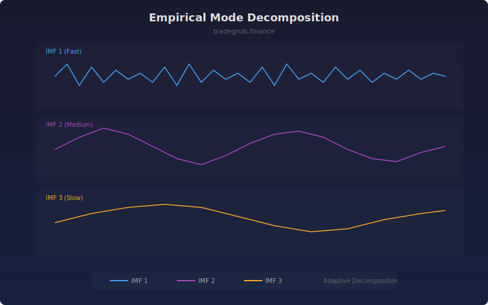

# Empirical Mode Decomposition

Decomposes price data into intrinsic mode functions (IMFs) using an adaptive, data-driven approach. Unlike Fourier or wavelet methods, EMD makes no assumptions about the underlying waveform, making it ideal for non-stationary financial data.

## How It Works

- Identifies local maxima and minima in the signal to construct upper and lower envelopes
- Subtracts the mean envelope through iterative sifting to extract each IMF
- Each successive IMF captures progressively lower frequency oscillations
- IMF 1 contains the highest frequency (noise/short cycles), later IMFs capture longer trends
- The residual after all IMFs represents the overall drift

## Parameters

| Parameter | Default | Range | Description |
|-----------|---------|-------|-------------|
| Number of IMFs | 3 | 1-5 | How many intrinsic mode functions to extract |
| Sifting Iterations | 10 | 3-30 | Iterations per IMF extraction (more = cleaner) |

## Outputs

- **IMF 1**: Highest frequency component (blue)
- **IMF 2**: Medium frequency component (purple)
- **IMF 3**: Lower frequency component (orange)
- **IMF 4-5**: Additional lower frequency components if enabled

## Usage Notes

- IMF 1 is mostly noise; IMFs 2-3 typically contain tradeable cycle information
- When multiple IMFs align in direction, it suggests a strong move across timeframes
- Compare IMF amplitudes to gauge whether short-term or long-term forces dominate
