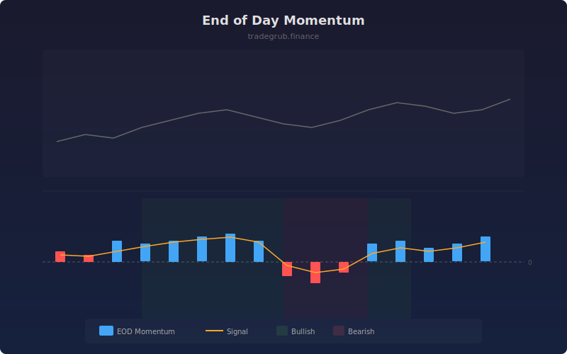

# End of Day Momentum

Measures price momentum during the final bars of each session to identify potential continuation or reversal patterns into the next session. Strong late-session momentum often carries over into the following open, providing an edge for overnight or swing positioning.

## How It Works

- Calculates percentage price change over the last N bars of each session
- Applies a smoothing moving average to create a signal line for trend detection
- Highlights bullish conditions when EOD momentum is positive and above the signal
- Highlights bearish conditions when EOD momentum is negative and below the signal
- Zero line crossovers indicate shifts in late-session sentiment

## Parameters

| Parameter | Default | Range | Description |
|-----------|---------|-------|-------------|
| Session Length (bars) | 12 | 4-50 | Number of bars per trading session |
| EOD Bars to Measure | 3 | 1-10 | How many bars at session end to measure momentum |
| Smoothing Period | 5 | 1-20 | Moving average period for signal line |

## Outputs

- **EOD Momentum**: Blue histogram showing late-session momentum percentage
- **Signal**: Orange smoothed signal line
- **Zero Line**: Dashed reference line
- **Background**: Green shading for bullish, red for bearish conditions

## Usage Notes

- Strong positive EOD momentum with rising signal suggests bullish continuation into the next session
- Divergence between EOD momentum and next-session direction can indicate exhaustion
- Works best when combined with volume analysis to confirm institutional participation
