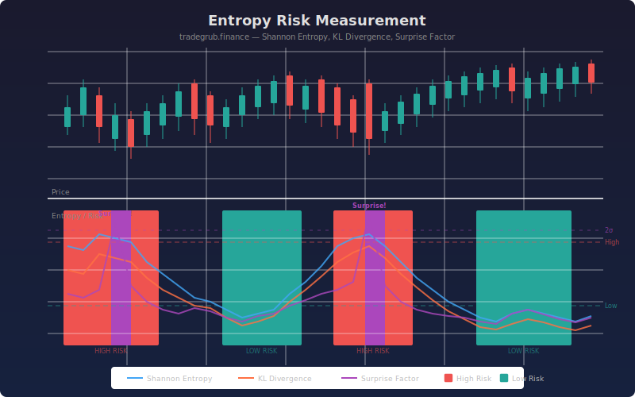

# Entropy Risk Measurement

This indicator applies information theory concepts to financial markets by measuring the entropy (disorder) of rolling return distributions. It computes three complementary risk signals: Shannon entropy to quantify how unpredictable recent returns have been, Kullback-Leibler (KL) divergence to measure how far the empirical return distribution has drifted from a normal (Gaussian) baseline, and a surprise factor that flags individual returns that are statistical outliers relative to recent history.

Together these three metrics give traders a real-time view of market regime risk. Periods of high entropy and elevated KL divergence indicate chaotic, hard-to-model price action where standard assumptions break down. Low entropy periods suggest orderly, trending markets where risk is more manageable. Surprise spikes highlight individual bars where something genuinely unusual happened, regardless of the broader entropy regime.

## Conceptual Diagram



## How It Works

Shannon entropy is calculated over a rolling window of log returns. At each bar, the indicator builds a histogram of the most recent N returns, normalizes the bin counts into a probability distribution, and computes the entropy in bits. A uniform distribution (all bins equally likely) produces maximum entropy, meaning returns are completely unpredictable. A distribution concentrated in one or two bins produces low entropy, meaning returns are behaving consistently. The number of histogram bins is configurable: more bins capture finer distribution detail but require more data to be statistically meaningful.

KL divergence compares the empirical return distribution against a fitted normal distribution with the same mean and standard deviation. When KL divergence is near zero, returns are behaving roughly like a Gaussian process. When KL divergence rises, the empirical distribution has developed fat tails, skewness, or multimodal structure that a normal model would miss entirely. This is a direct measure of "how wrong is the normal assumption right now" and is particularly useful for options pricing and volatility modeling.

The surprise factor is the simplest of the three metrics. It computes how many standard deviations the current bar's return is from the rolling mean return. Values beyond 2 sigma are flagged as surprise events. Unlike entropy and KL divergence which characterize the distribution shape, the surprise factor operates on individual bars and can spike even during low-entropy regimes if a single anomalous return occurs.

## Parameters

| Parameter | Default | Range | Description |
|-----------|---------|-------|-------------|
| Lookback Period | 50 | 20-200 | Rolling window for distribution analysis |
| Distribution Bins | 20 | 5-50 | Number of histogram bins for entropy calculation |
| High Entropy Threshold | 2.5 | 1.0-4.0 | Shannon entropy level marking high risk |
| Low Entropy Threshold | 1.5 | 0.5-3.0 | Shannon entropy level marking low risk |
| Show Labels | true | -- | Toggle risk zone annotations |
| Show Levels | true | -- | Toggle threshold reference lines |
| Label Cooldown Bars | 20 | 5-50 | Minimum bars between labels |

## Outputs

- **Shannon Entropy (blue):** Rolling entropy of return distribution in bits
- **KL Divergence (orange):** Divergence from normal distribution in bits
- **Surprise Factor (purple):** Current return z-score relative to rolling window
- **Background shading:** Red tint for high entropy, green tint for low entropy, purple for surprise spikes
- **Labels:** High/low risk zone annotations and surprise spike markers

## Python Advantage

This indicator relies on scipy.stats.entropy for computing both Shannon entropy and KL divergence with numerical stability, including proper handling of zero-probability bins via Laplace smoothing. It also uses scipy.stats.norm.pdf to generate the theoretical normal distribution for KL comparison, and numpy.histogram for fast, vectorized binning of return windows. Pine has no equivalent to histogram-based distribution analysis or information-theoretic divergence measures, making this type of analysis exclusive to Python-powered indicators.

```python
from scipy.stats import entropy as sp_entropy
from scipy.stats import norm

hist_counts, bin_edges = np.histogram(window, bins=num_bins)
kl = sp_entropy(empirical_probs, normal_probs, base=2)
```

## Usage Notes

- High entropy zones often precede major breakouts or breakdowns. When returns become maximally disordered, the market is "choosing" a direction, and the subsequent move tends to be large.
- Combining entropy with KL divergence provides a two-dimensional risk view. High entropy with low KL means chaotic but still roughly normal returns. High entropy with high KL means the distribution itself has changed shape, which is a stronger warning signal.
- Surprise factor spikes during low-entropy regimes deserve special attention. These represent genuinely anomalous events occurring during otherwise orderly markets, often the first sign of a regime change.
- Use the label cooldown parameter to reduce visual clutter on lower timeframes where entropy transitions happen frequently.
- This indicator pairs well with volatility-based indicators like Bollinger Bands or ATR. Entropy measures distributional complexity while volatility measures magnitude, and the two can diverge in informative ways.
