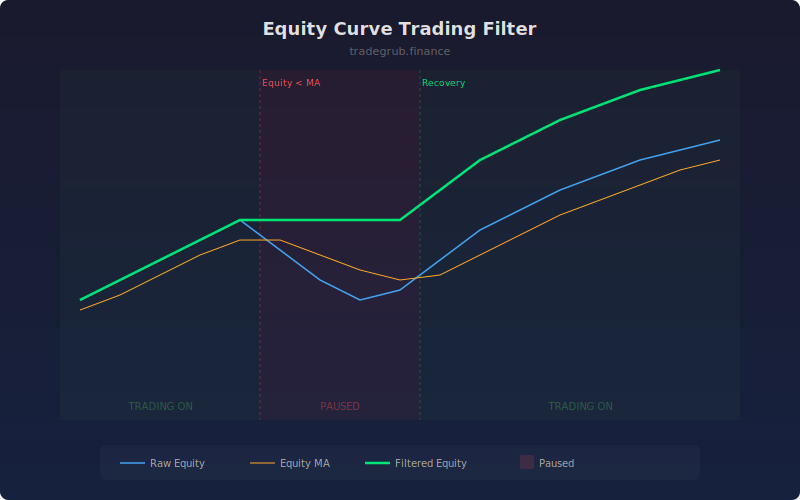

# Equity Curve Trading Filter

Monitors a simulated equity curve and pauses trading when performance drops below its moving average or exceeds a drawdown threshold. This meta-strategy filter reduces exposure during unfavorable periods and re-engages when the equity curve recovers.

## How It Works

- Simulates a simple trend-following equity curve using fast/slow moving average crossover
- Calculates a moving average of the equity curve itself as a health indicator
- Pauses trading when equity falls below its MA or drawdown exceeds the threshold
- Shows filtered equity (only counting trades taken during "on" periods)
- Green background indicates active trading, red indicates paused periods

## Parameters

| Parameter | Default | Range | Description |
|-----------|---------|-------|-------------|
| Equity MA Length | 20 | 5-100 | Moving average period applied to equity curve |
| Signal Length | 14 | 5-50 | Period for the underlying trend-following signals |
| Pause Drawdown % | 5.0 | 1.0-20.0 | Maximum drawdown before pausing trades |

## Outputs

- **Raw Equity**: Blue line showing unfiltered equity curve
- **Equity MA**: Orange moving average of equity curve
- **Filtered Equity**: Green line showing equity with filter applied
- **Background**: Green when trading active, red when paused

## Usage Notes

- The filtered equity line should outperform raw equity if the filter adds value
- Adjust the equity MA length to balance responsiveness against whipsaw avoidance
- Works as a meta-layer on top of any existing strategy to manage regime risk
