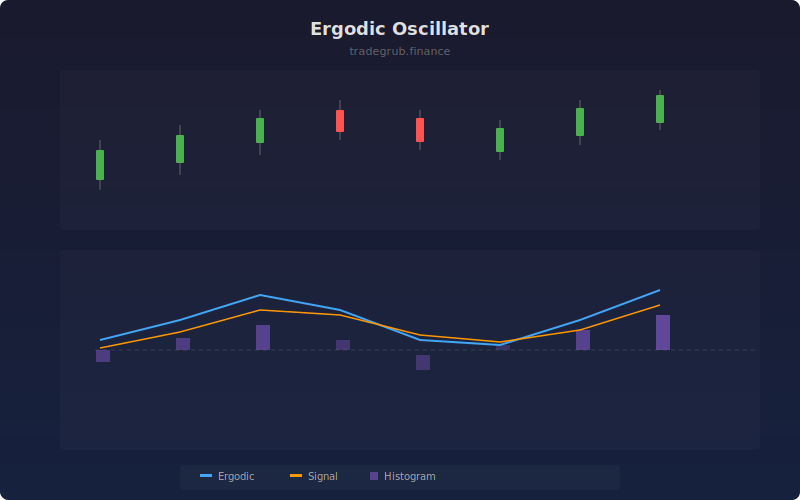

# Ergodic Oscillator

The Ergodic Oscillator is based on the True Strength Index, applying double exponential smoothing to price momentum normalized by absolute momentum. The result is a bounded oscillator that provides clean crossover signals between the main line and its signal line.

## How It Works

- Calculates bar-to-bar price momentum (close minus previous close)
- Double-smooths both momentum and absolute momentum using two EMA periods
- Divides smoothed momentum by smoothed absolute momentum, scaled to 100
- Generates a signal line from the EMA of the oscillator
- Crossovers between the oscillator and signal line trigger buy/sell signals

## Parameters

| Parameter | Default | Range | Description |
|-----------|---------|-------|-------------|
| Long Period | 25 | 5-100 | First EMA smoothing length |
| Short Period | 13 | 3-50 | Second EMA smoothing length |
| Signal Length | 5 | 2-20 | Signal line EMA period |

## Outputs

- **Ergodic**: Main oscillator line (blue)
- **Signal**: Signal line for crossovers (orange)
- **Histogram**: Momentum difference (purple bars)
- **Markers**: Crossover signal arrows

## Usage Notes

- Crossovers above zero are stronger bullish signals than those below zero
- The oscillator ranges roughly from -100 to +100 with zero as the neutral point
- Works well for identifying momentum divergences against price action
