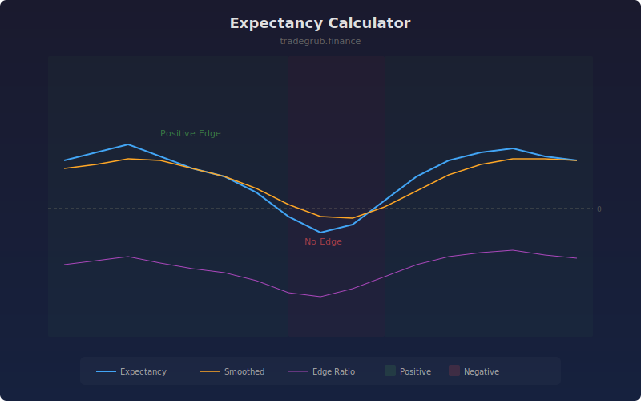

# Expectancy Calculator

Calculates the mathematical expectancy per trade using rolling win rate and average win/loss magnitudes. Positive expectancy means the strategy has a statistical edge, while negative expectancy signals that continued trading will result in losses over time.

## How It Works

- Classifies each bar-over-bar return as a win (positive) or loss (negative)
- Calculates rolling win rate, average win size, and average loss size
- Applies the expectancy formula: (win rate x avg win) - (loss rate x avg loss)
- Computes edge ratio as average win divided by average loss
- Smooths expectancy with a moving average for trend identification

## Parameters

| Parameter | Default | Range | Description |
|-----------|---------|-------|-------------|
| Lookback Period | 50 | 10-200 | Number of bars for rolling calculation |
| Smoothing | 10 | 1-30 | Moving average period for smoothed expectancy |

## Outputs

- **Expectancy**: Blue line showing raw expectancy per trade (in percentage points)
- **Smoothed**: Orange smoothed expectancy line
- **Edge Ratio**: Purple line showing average win divided by average loss
- **Background**: Green for positive expectancy, red for negative

## Usage Notes

- Positive expectancy is necessary but not sufficient for profitable trading; position sizing matters
- Edge ratio above 1.0 means average wins exceed average losses in magnitude
- A strategy with low win rate can still have positive expectancy if the edge ratio is high enough
