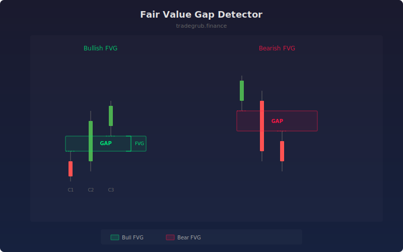

# Fair Value Gap Detector

The Fair Value Gap (FVG) Detector identifies price imbalances in three-candle sequences where the first and third candles do not overlap, leaving an unfilled gap. These gaps represent areas where one side of the market dominated and price may return to rebalance.

## How It Works

- Examines each three-candle sequence for non-overlapping wicks
- Bullish FVG: third candle's low is above first candle's high (gap up)
- Bearish FVG: first candle's low is above third candle's high (gap down)
- Filters gaps by minimum size relative to ATR to avoid noise
- Draws shaded boxes showing the gap zone that may be revisited

## Parameters

| Parameter | Default | Range | Description |
|-----------|---------|-------|-------------|
| Min Gap Size | 0.5 | 0.1-3.0 | Minimum gap as ATR multiple |
| Max Displayed Gaps | 10 | 1-30 | Maximum gap zones to draw |
| Show Bullish FVG | true | - | Display bullish gap zones |
| Show Bearish FVG | true | - | Display bearish gap zones |
| Show Labels | true | - | Display FVG text labels |

## Outputs

- **Bull FVG Boxes**: Green shaded zones marking bullish imbalances
- **Bear FVG Boxes**: Red shaded zones marking bearish imbalances
- **Markers**: Triangle markers at gap detection bars
- **Labels**: FVG text labels on recent gaps

## Usage Notes

- Price tends to return to fill fair value gaps before continuing in the trend direction
- Unfilled gaps act as magnets for future price action
- Combine with order blocks for higher-confidence entry zones
